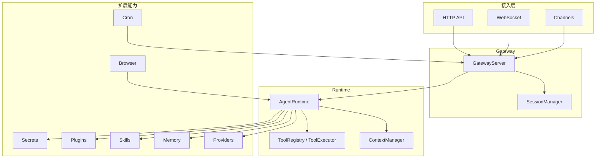

# TigerClaw

TigerClaw 是一个基于 Python 的 **AI Agent Gateway**，用于把模型调用、会话管理、记忆、定时任务、密钥管理、浏览器自动化和渠道接入整合到统一的网关层中。

项目当前代码以 `FastAPI + Uvicorn + Typer` 为基础，提供：

- HTTP API 与 WebSocket 接入
- Agent 运行时与工具注册/执行
- 多模型提供商适配层
- Session / Memory / Cron / Secrets 等基础能力
- Skills、Plugins、Browser、Daemon 等扩展模块
- 一套覆盖日常运维和调试的 CLI

## 核心能力

- **网关层**：统一承载 HTTP、WebSocket、健康检查和会话入口
- **Agent 运行时**：负责上下文构建、模型调用、工具执行和结果流式返回
- **模型提供商**：内置 `openai`、`anthropic`、`minimax`、`openrouter`、`custom`
- **会话管理**：支持 Session 创建、消息追加、会话查询与清理
- **记忆系统**：支持记忆写入、检索与语义搜索
- **定时任务**：支持 Cron 任务的增删查和调度运行
- **密钥管理**：支持密钥存储、读取、删除和审计相关能力
- **浏览器自动化**：支持打开页面、截图和导出 PDF
- **插件与技能**：支持扩展工具、通道、Provider 和自定义技能

## 架构概览



## 目录结构

```text
.
├── src/tigerclaw/
│   ├── agents/      # Agent 运行时、上下文、工具、模型目录
│   ├── browser/     # 浏览器自动化
│   ├── channels/    # 渠道接入
│   ├── cli/         # Typer CLI
│   ├── config/      # 配置加载与热重载
│   ├── cron/        # 定时任务
│   ├── daemon/      # 守护进程管理
│   ├── gateway/     # HTTP / WebSocket / Session
│   ├── memory/      # 记忆管理与检索
│   ├── plugins/     # 插件系统
│   ├── providers/   # 模型提供商适配
│   ├── secrets/     # 密钥管理
│   └── skills/      # 技能系统
├── context/         # 架构、业务、经验文档
├── config.yaml      # 仓库内示例配置
├── example.env      # 环境变量示例
└── pyproject.toml
```

## 环境要求

- Python `>= 3.13`
- `uv`
- 如需使用浏览器功能，首次运行前建议安装 Playwright 浏览器

## 快速开始

### 1. 创建虚拟环境

```bash
uv venv
```

Windows PowerShell:

```powershell
.\.venv\Scripts\Activate.ps1
```

macOS / Linux:

```bash
source .venv/bin/activate
```

### 2. 安装依赖

```bash
uv pip install -e ".[dev]"
```

如果只需要运行，不做开发：

```bash
uv pip install -e .
```

### 3. 配置环境变量

仓库已提供 `example.env`，可复制为 `.env` 后填写密钥：

```bash
cp example.env .env
```

当前仓库示例配置使用的是自定义 OpenAI 兼容网关，因此至少需要配置：

```env
CUSTOM_API_KEY=your-api-key
```

### 4. 检查配置文件

仓库根目录已带有 `config.yaml`，默认内容类似：

```yaml
gateway:
  host: "0.0.0.0"
  port: 3000
  bind: "loopback"

model:
  default_model: "glm-5"
  providers:
    custom:
      base_url: "https://your-openai-compatible-endpoint/v1"
      api_key: "${CUSTOM_API_KEY}"
      models:
        - "glm-5"
```

建议优先使用 `config.yaml` 或 `config.yml`。

### 5. 启动网关

```bash
uv run tigerclaw gateway start
```

如果直接使用仓库自带的 `config.yaml`，服务通常会监听在 `3000` 端口。

### 6. 验证服务

```bash
curl http://127.0.0.1:3000/health
```

也可以先做一次环境诊断：

```bash
uv run tigerclaw doctor run
```

## 配置说明

TigerClaw 的配置来源主要有三类：

1. 环境变量，例如 `TIGERCLAW_*`
2. 当前目录或用户目录下的 YAML 配置文件
3. 代码默认值

推荐把业务配置放在 `config.yaml`，把密钥放在 `.env`。

### 常见配置项

```yaml
gateway:
  host: "127.0.0.1"
  port: 18789
  bind: "loopback"  # auto / lan / loopback / custom / tailnet

model:
  default_model: "gpt-4o-mini"
  providers:
    openai:
      base_url: "https://api.openai.com/v1"
      api_key: "${OPENAI_API_KEY}"
      models:
        - "gpt-4o-mini"
        - "gpt-4.1"

channel:
  enabled_channels:
    - "feishu"
```

### 环境变量占位

配置文件支持：

- `${VAR_NAME}`
- `${VAR_NAME:-default}`

例如：

```yaml
api_key: "${OPENAI_API_KEY}"
base_url: "${OPENAI_BASE_URL:-https://api.openai.com/v1}"
```

## HTTP API 与 WebSocket

### HTTP 端点

- `GET /`：基础健康检查
- `GET /health`：健康检查
- `POST /sessions`：创建会话
- `GET /sessions`：列出会话
- `GET /sessions/{session_id}`：查询会话
- `DELETE /sessions/{session_id}`：结束会话
- `POST /sessions/{session_id}/messages`：向会话追加消息
- `GET /sessions/{session_id}/messages`：列出会话消息

### WebSocket 端点

- `GET /ws`
- `GET /ws/{session_id}`

建立连接后，服务端会先返回一条 `connected` 消息。

## 常用 CLI

TigerClaw 的 CLI 入口为 `tigerclaw`，常见命令如下：

| 命令组 | 常用命令 | 说明 |
|--------|----------|------|
| `gateway` | `start` / `status` | 启动网关、查看网关配置 |
| `agent` | `chat` / `tools` | 与 Agent 对话、查看工具 |
| `config` | `list` / `get` / `set` / `reload` | 查看与调整配置 |
| `cron` | `list` / `add` / `remove` / `start` | 管理定时任务 |
| `daemon` | `list` / `start` / `stop` / `status` | 管理守护进程 |
| `memory` | `add` / `search` / `list` / `clear` | 管理记忆数据 |
| `browser` | `open` / `screenshot` / `pdf` | 浏览器自动化 |
| `secrets` | `list` / `get` / `set` / `delete` | 管理密钥 |
| `skills` | `list` / `run` / `info` | 管理技能 |
| `doctor` | `run` | 运行系统诊断 |
| `status` | `show` | 查看整体服务状态 |
| `models` | `list` / `info` | 查看模型目录 |
| `plugins` | `list` / `info` / `enable` / `disable` | 管理插件 |
| `sessions` | `list` / `info` / `kill` | 管理会话 |

示例：

```bash
uv run tigerclaw gateway status
uv run tigerclaw agent tools
uv run tigerclaw agent chat "你好"
uv run tigerclaw models list
uv run tigerclaw status show
```

## 浏览器能力

如需使用 `browser` 命令，建议先安装浏览器运行时：

```bash
uv run playwright install chromium
```

示例：

```bash
uv run tigerclaw browser open https://example.com
uv run tigerclaw browser screenshot https://example.com
uv run tigerclaw browser pdf https://example.com
```

## 开发说明

### 安装开发依赖

```bash
uv pip install -e ".[dev]"
```

### 代码检查

```bash
uv run ruff check src
```

### 版本信息

- 当前版本：`0.1.0`
- 打包入口：`tigerclaw = tigerclaw.cli:app`

## 文档导航

项目把背景知识放在 `context/` 目录下：

- `context/tech/services/README.md`：服务架构概览
- `context/tech/services/service-list.md`：服务清单
- `context/business/README.md`：业务逻辑概览
- `context/business/glossary.md`：术语表

按领域继续细看时，可从这些目录进入：

- `context/business/domains/agent/`
- `context/business/domains/session/`
- `context/business/domains/memory/`
- `context/business/domains/cron/`
- `context/business/domains/secrets/`

## License

本项目使用 `MIT` License，详见 `LICENSE`。
