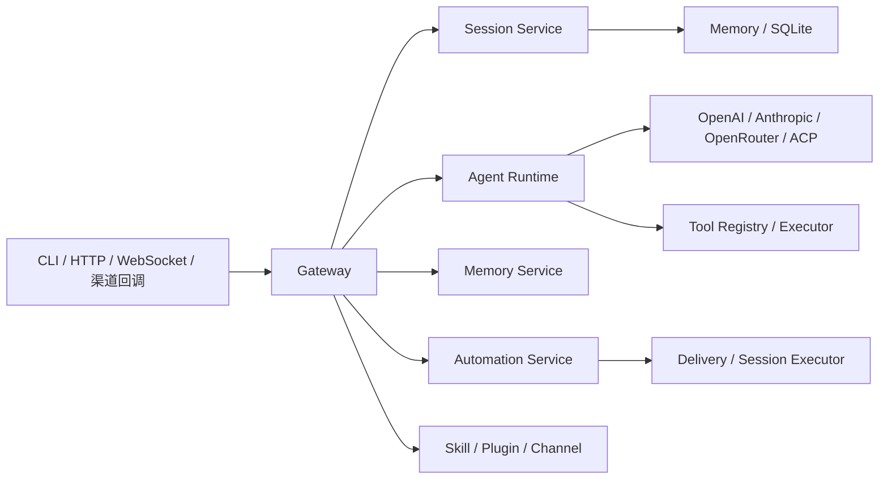

# TigerClaw

TigerClaw 是 OpenClaw 的 Python 3.14 实现版本，目标是提供一个统一的 AI Agent 网关运行时，覆盖模型调用、会话管理、工具执行、自动化任务和多渠道接入。

## 当前定位

TigerClaw 当前是一个单仓库、单进程优先、按子系统划分职责的 Python 系统。对外主入口有两类：

- `tigerclaw gateway start`：启动 FastAPI Gateway，提供 HTTP / WebSocket 接口
- `tigerclaw ...`：执行配置、诊断、模型、会话、审批、浏览器等 CLI 管理命令

## 核心能力

- Gateway 接入层：FastAPI、HTTP、WebSocket、健康检查、TLS、认证、限流
- Agent Runtime：上下文管理、工具调用、超时控制、重试、模型降级
- 会话服务：会话创建、恢复、归档、消息持久化、Token 统计
- 自动化服务：`at` / `every` / `cron` 调度、任务执行、失败告警、结果投递
- 记忆服务：基础记忆读写与上下文拼装，预留 embedding / vector / sqlite 扩展
- 扩展机制：Skill、Plugin、Channel 三条扩展线并存
- 多渠道能力：飞书、Slack、Discord、Telegram

## 架构总览



更完整的服务架构说明见 [context/tech/services/README.md](context/tech/services/README.md)。

## 业务主线

### 会话与聊天

1. 请求进入 Gateway
2. 通过认证与限流
3. 创建或恢复会话
4. 调用 Agent Runtime
5. 写回消息、统计和交付上下文

### 自动化任务

1. 任务按 `at`、`every`、`cron` 规则调度
2. 处理器执行任务
3. 成功结果可投递到渠道或 webhook
4. 失败时可按失败目标发送告警

### 渠道管理

1. 读取渠道配置
2. 判断启用状态和配置完整性
3. 维护多账户配置
4. 在后续交付场景中复用账户上下文

更完整的业务流程、规则和状态机见 [context/business/README.md](context/business/README.md)。

## 环境要求

- Python >= 3.14
- `uv`

## 安装

```bash
git clone https://github.com/openclaw/tigerclaw.git
cd tigerclaw

uv venv
.venv\Scripts\activate  # Windows
# source .venv/bin/activate  # Linux/macOS

uv pip install -e ".[dev]"

# 按需安装可选能力
uv pip install -e ".[openai,anthropic,openrouter,feishu]"
```

## 快速开始

### 1. 初始化配置

```bash
tigerclaw config init
```

### 2. 启动 Gateway

```bash
tigerclaw gateway start

# 指定地址和端口
tigerclaw gateway start --bind 127.0.0.1 --port 18789
```

### 3. 查看诊断信息

```bash
tigerclaw doctor info
tigerclaw doctor check
```

### 4. 常用管理命令

```bash
tigerclaw config list
tigerclaw models --help
tigerclaw sessions --help
tigerclaw approvals --help
tigerclaw browser --help
```

## 配置示例

```yaml
gateway:
  bind: loopback
  port: 18789
  auth:
    mode: token
    token: ${TIGERCLAW_GATEWAY_TOKEN}
    rate_limit:
      max_attempts: 5
      window_ms: 60000
      lockout_ms: 300000

logging:
  level: INFO
  file_enabled: false

channels:
  feishu:
    enabled: false
  slack:
    enabled: false
```

更详细的配置结构见 [src/core/types/config.py](src/core/types/config.py)。

## 接口示例

### 健康检查

```bash
curl http://127.0.0.1:18789/health
curl http://127.0.0.1:18789/health/live
curl http://127.0.0.1:18789/health/ready
```

### HTTP API

当前代码中的 OpenAI 兼容聊天路径为：

```bash
POST /api/v1/v1/chat/completions
```

示例：

```bash
curl -X POST http://127.0.0.1:18789/api/v1/v1/chat/completions \
  -H "Authorization: Bearer YOUR_TOKEN" \
  -H "Content-Type: application/json" \
  -d '{
    "model": "gpt-4",
    "messages": [{"role": "user", "content": "你好"}]
  }'
```

其他常见 HTTP 路径：

- `GET /api/v1/auth/status`
- `POST /api/v1/sessions`
- `GET /api/v1/sessions`
- `GET /api/v1/models`
- `GET /api/v1/channels`

### WebSocket RPC

```javascript
const ws = new WebSocket("ws://127.0.0.1:18789/ws?token=YOUR_TOKEN");

ws.onopen = () => {
  ws.send(JSON.stringify({
    id: "1",
    method: "chat",
    params: {
      message: "你好",
      stream: true
    }
  }));
};
```

常见 RPC 方法：

- `chat`
- `sessions.create`
- `sessions.resume`
- `sessions.archive`
- `sessions.list`
- `config.get`
- `config.reload`
- `models.list`
- `tools.execute`
- `exec.approvals.*`

## 项目结构

```text
tigerclaw/
├── src/
│   ├── agents/          # Agent Runtime
│   ├── browser/         # 浏览器 / CDP 能力
│   ├── channels/        # 渠道注册表与适配器
│   ├── cli/             # CLI 命令
│   ├── core/            # 配置、日志、类型
│   ├── gateway/         # Gateway 服务
│   ├── infra/           # 配对、审批、远程交互
│   ├── plugins/         # 插件系统
│   ├── security/        # 安全模块
│   ├── services/        # cron / memory / performance / skills
│   └── sessions/        # 会话管理与存储
├── extensions/          # 扩展样例
├── tests/               # 测试
└── context/
    ├── tech/services/   # 服务架构文档
    └── business/        # 业务逻辑文档
```

## 开发

```bash
uv run pytest
uv run ruff check src tests
uv run ruff format src tests
uv run pyright
```

## 当前实现说明

- Gateway 启动时会挂载会话、记忆、Cron、健康检查等子系统，是当前运行时编排中心。
- 记忆服务默认是基础内存实现，增强版 embedding / vector / sqlite 能力仍在逐步接入。
- 渠道管理当前更偏配置驱动的内置渠道管理，不是完全动态插件发现。
- WebSocket RPC 与 HTTP 路径的依赖注入还没有完全统一，属于后续可继续收敛的实现细节。

## 许可证

MIT License
