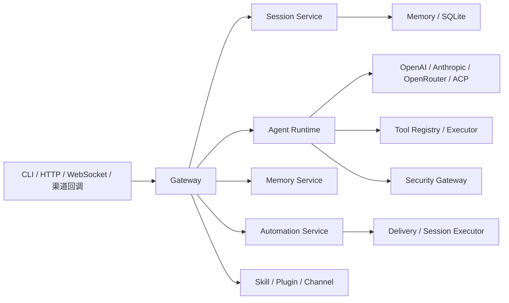

# TigerClaw

TigerClaw 是一个统一的 AI Agent 网关运行时，覆盖模型调用、会话管理、工具执行、自动化任务和多渠道接入。

## 核心能力

- **Gateway 接入层**：FastAPI、HTTP、WebSocket、健康检查、TLS、认证、限流
- **Agent Runtime**：上下文管理、工具调用、超时控制、重试、模型降级
- **安全体系**：统一安全网关、文件访问守卫、网络请求守卫、命令分析器、Windows 沙箱支持
- **会话服务**：会话创建、恢复、归档、消息持久化、Token 统计
- **自动化服务**：`at` / `every` / `cron` 调度、任务执行、失败告警、结果投递
- **记忆服务**：基础记忆读写与上下文拼装，支持 embedding / vector / sqlite 扩展
- **扩展机制**：Skill、Plugin、Channel 三条扩展线并存
- **多渠道能力**：飞书

## 架构总览



## 业务主线

### 会话与聊天

1. 请求进入 Gateway
2. 通过认证与限流
3. 创建或恢复会话
4. 调用 Agent Runtime（通过安全网关）
5. 写回消息、统计和交付上下文

### 自动化任务

1. 任务按 `at`、`every`、`cron` 规则调度
2. 处理器执行任务
3. 成功结果可投递到渠道或 webhook
4. 失败时可按失败目标发送告警

### 渠道管理

1. 读取渠道配置
2. 判断启用状态和配置完整性
3. 维护多账户配置
4. 在后续交付场景中复用账户上下文

## 环境要求

- Python >= 3.14
- `uv`

## 安装

```bash
git clone https://github.com/openclaw/tigerclaw.git
cd tigerclaw

uv sync

cd ui && npm install && cd ..
```

## 快速开始

### 1. 初始化配置

```bash
uv run tigerclaw config init
```

### 2. 配置环境变量

复制示例文件并填写你的 API 密钥：

```bash
cp .env.example .env
```

编辑 `.env`，填入你的大模型 API 配置：

```env
OPENAI_API_KEY=your-api-key
OPENAI_BASE_URL=https://api-inference.modelscope.cn/v1
OPENAI_MODEL=ZhipuAI/GLM-5
```

前端也需要单独配置，在 `ui/` 目录下创建 `.env.local`：

```env
VITE_OPENAI_BASE_URL=https://api-inference.modelscope.cn/v1
VITE_OPENAI_API_KEY=your-api-key
VITE_OPENAI_MODEL=ZhipuAI/GLM-5
VITE_GATEWAY_URL=http://localhost:18789
```

### 3. 启动后端

```bash
uv run tigerclaw gateway start

# 或指定地址和端口
uv run tigerclaw gateway start --bind 127.0.0.1 --port 18789
```

### 4. 启动前端

```bash
cd ui
npm run dev
```

前端默认运行在 http://localhost:5173，通过 Vite proxy 代理到后端 `http://localhost:18789`。

### 5. 查看诊断信息

```bash
uv run tigerclaw doctor info
uv run tigerclaw doctor check
```

### 6. 常用管理命令

```bash
uv run tigerclaw config list
uv run tigerclaw models --help
uv run tigerclaw sessions --help
uv run tigerclaw approvals --help
uv run tigerclaw browser --help
```

## 配置示例

```yaml
gateway:
  bind: loopback
  port: 18789
  auth:
    mode: token
    token: ${TIGERCLAW_GATEWAY_TOKEN}
    rate_limit:
      max_attempts: 5
      window_ms: 60000
      lockout_ms: 300000

logging:
  level: INFO
  file_enabled: false

channels:
  feishu:
    enabled: false
```

更详细的配置结构见 [src/core/types/config.py](src/core/types/config.py)。

## 安全体系

TigerClaw 内置了统一的安全体系，保护大模型的工具调用：

### 统一安全网关

所有工具调用（bash、file_read、file_write、http_request）都通过 `UnifiedSecurityGateway` 进行安全检查：

```
请求 → 权限检查 → 工具分派守卫 → 审计日志
```

### 文件访问守卫

- 默认敏感路径保护：`.env`、`*.pem`、`*.key`、`.ssh/*`、`.aws/*` 等
- 敏感路径读取需要审批
- 支持自定义敏感路径模式

### 网络请求守卫

- 默认白名单：OpenAI、Anthropic、PyPI、GitHub 等常用 API 站点
- SSRF 防护：内网地址默认阻止
- 白名单外的 URL 需要审批

### 命令分析器

- 危险命令检测：`rm -rf /`、`mkfs`、`curl | sh` 等
- 编码绕过检测：base64、hex、octal 编码后的危险命令识别
- 四级安全评级：safe → warning → danger → critical
- critical 级别直接阻止，danger 级别需要审批

### Windows 沙箱

- 通过 Job Object 限制内存、CPU 时间和进程数
- 与 POSIX 平台的资源限制等价

## 接口示例

### 健康检查

```bash
curl http://127.0.0.1:18789/health
curl http://127.0.0.1:18789/health/live
curl http://127.0.0.1:18789/health/ready
```

### HTTP API

```bash
POST /api/v1/v1/chat/completions
```

示例：

```bash
curl -X POST http://127.0.0.1:18789/api/v1/v1/chat/completions \
  -H "Authorization: Bearer YOUR_TOKEN" \
  -H "Content-Type: application/json" \
  -d '{
    "model": "gpt-4",
    "messages": [{"role": "user", "content": "你好"}]
  }'
```

其他常见 HTTP 路径：

- `GET /api/v1/auth/status`
- `POST /api/v1/sessions`
- `GET /api/v1/sessions`
- `GET /api/v1/models`
- `GET /api/v1/channels`

### WebSocket RPC

```javascript
const ws = new WebSocket("ws://127.0.0.1:18789/ws?token=YOUR_TOKEN");

ws.onopen = () => {
  ws.send(JSON.stringify({
    id: "1",
    method: "chat",
    params: {
      message: "你好",
      stream: true
    }
  }));
};
```

常见 RPC 方法：

- `chat`
- `sessions.create`
- `sessions.resume`
- `sessions.archive`
- `sessions.list`
- `config.get`
- `config.reload`
- `models.list`
- `tools.execute`
- `exec.approvals.*`

## 项目结构

```text
tigerclaw/
├── src/
│   ├── agents/          # Agent Runtime（故障转移、模型降级、工具执行）
│   │   ├── acp/         #   Agent Communication Protocol 客户端
│   │   ├── auth_profiles/ # 认证配置档案管理
│   │   ├── plugins/     #   Provider 工厂与注册表
│   │   ├── providers/   #   LLM Provider（OpenAI / Anthropic / OpenRouter / Codex）
│   │   └── tools/       #   工具执行（bash、权限控制、安全网关）
│   ├── auto_reply/      # 自动回复引擎（分块、模板、命令）
│   ├── browser/         # 浏览器 / CDP 能力
│   ├── channels/        # 渠道注册表与适配器
│   │   ├── adapters/    #   通用适配器（命令/配置/生命周期/安全/流式）
│   │   └── feishu/      #   飞书渠道实现
│   ├── cli/             # CLI 命令（Typer + Rich）
│   │   └── commands/    #   子命令（gateway/config/doctor/sessions/models 等）
│   ├── core/            # 核心基础设施
│   │   ├── config/      #   配置加载/热重载/快照
│   │   ├── logging/     #   日志/审计/指标/脱敏
│   │   └── types/       #   全局类型定义（Pydantic 模型）
│   ├── daemon/          # 守护进程管理（systemd / launchd / schtasks）
│   ├── gateway/         # Gateway 服务（FastAPI）
│   │   ├── methods/     #   RPC 方法处理器
│   │   └── middleware/  #   中间件（安全/计时）
│   ├── infra/           # 基础设施（配对、审批、消息投递）
│   │   └── outbound/    #   消息投递（队列/媒体/载荷）
│   ├── plugins/         # 插件系统（注册表/钩子/加载器/热重载/沙箱）
│   ├── security/        # 安全模块（运行时安全/密钥管理）
│   ├── services/        # 业务服务
│   │   ├── cron/        #   定时任务（at / every / cron）
│   │   ├── memory/      #   记忆服务（内存/文件/SQLite/向量）
│   │   ├── performance/ #   性能优化（缓存/连接池/异步优化器）
│   │   ├── skills/      #   技能系统
│   │   └── trace/       #   LLM 执行轨迹记录（SQLite 存储）
│   └── sessions/        # 会话管理（内存缓存 + SQLite 持久化）
├── ui/                  # 前端（Vue 3 + Vite）
│   ├── src/
│   │   ├── components/  #   页面组件（聊天/轨迹等）
│   │   └── services/    #   API 服务层
│   └── vite.config.js   #   Vite 配置（含后端代理）
└── tests/               # 测试
```

## 开发

```bash
uv run pytest
uv run ruff check src tests
uv run ruff format src tests
uv run pyright
```

## 当前实现说明

- Gateway 启动时会挂载会话、记忆、Cron、健康检查等子系统，是当前运行时编排中心。
- 记忆服务默认是基础内存实现，增强版 embedding / vector / sqlite 能力仍在逐步接入。
- 渠道管理当前更偏配置驱动的内置渠道管理，不是完全动态插件发现。
- WebSocket RPC 与 HTTP 路径的依赖注入还没有完全统一，属于后续可继续收敛的实现细节。

## 许可证

MIT License
