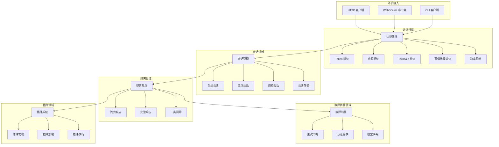

# TigerClaw 业务逻辑概览

## 项目简介

TigerClaw 是一个 AI Agent 网关服务，提供统一的 LLM 调用接口、会话管理、工具执行等能力。本文档描述系统的核心业务逻辑。

## 业务领域

TigerClaw 包含以下核心业务领域：

| 领域 | 描述 | 优先级 |
|------|------|--------|
| 认证 (Authentication) | 网关访问认证与授权 | Critical |
| 会话 (Session) | 用户会话生命周期管理 | Critical |
| 聊天 (Chat) | LLM 对话交互处理 | Critical |
| 故障转移 (Failover) | LLM 调用失败处理 | High |
| 插件 (Plugin) | 扩展功能管理 | Medium |

## 业务架构图



## 核心业务流程

### 1. 用户请求处理流程

```
用户请求 → 认证验证 → 会话获取/创建 → 聊天处理 → 响应返回
                ↓
           认证失败 → 速率限制检查 → 返回错误
```

### 2. 聊天交互流程

```
接收消息 → 添加到上下文 → 调用 LLM → 处理响应 → 更新会话
                              ↓
                        调用失败 → 故障转移 → 重试/降级
```

### 3. 故障转移流程

```
错误发生 → 错误分类 → 策略选择 → 执行策略 → 恢复/终止
                              ↓
                    重试/认证轮换/模型降级/终止
```

## 业务规则概览

### 认证规则

| 规则ID | 描述 |
|--------|------|
| AUTH-001 | Token 认证必须匹配配置的 Token |
| AUTH-002 | 密码认证必须匹配配置的密码 |
| AUTH-003 | 可信代理必须来自配置的代理地址 |
| AUTH-004 | 认证失败触发速率限制 |

### 会话规则

| 规则ID | 描述 |
|--------|------|
| SESS-001 | 会话 ID 不提供时自动生成 |
| SESS-002 | 会话空闲超时后自动归档 |
| SESS-003 | 会话消息数量计入 Token 统计 |

### 聊天规则

| 规则ID | 描述 |
|--------|------|
| CHAT-001 | 模型名称决定提供商选择 |
| CHAT-002 | 流式响应通过 WebSocket 回调 |
| CHAT-003 | 工具调用结果添加到上下文 |

### 故障转移规则

| 规则ID | 描述 |
|--------|------|
| FAIL-001 | 速率限制错误触发认证轮换 |
| FAIL-002 | 超时错误触发重试 |
| FAIL-003 | 上下文过长错误直接终止 |

## 详细文档

- [认证领域](domains/authentication/state-machine.md)
- [会话领域](domains/session/state-machine.md)
- [聊天领域](domains/chat/flows/)
- [故障转移领域](domains/failover/rules/)
- [插件领域](domains/plugin/flows/)

## 业务术语表

参见 [glossary.md](glossary.md)
