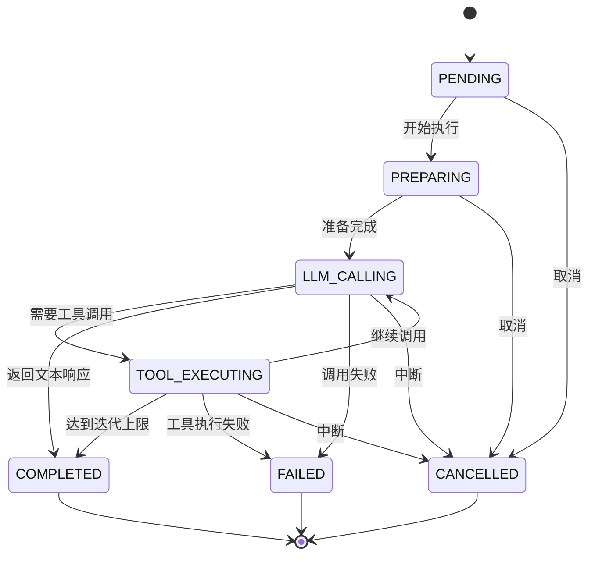
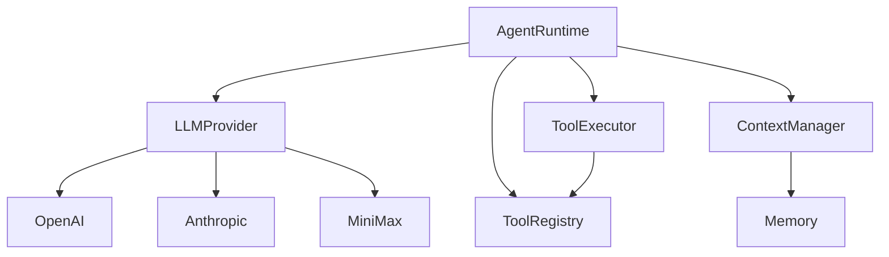

# Agent 领域业务逻辑

## 概述

Agent 领域是 TigerClaw 的核心业务领域，负责 AI Agent 的运行时管理、LLM 调用协调和工具执行。

## 业务实体

### AgentRuntime

Agent 运行时实体，管理 Agent 的执行生命周期。

| 属性 | 类型 | 说明 |
|------|------|------|
| provider | LLMProvider | LLM 提供商 |
| tool_registry | ToolRegistry | 工具注册表 |
| context | ContextManager | 上下文管理器 |
| config | RunConfig | 运行配置 |

### ToolCall

工具调用请求。

| 属性 | 类型 | 说明 |
|------|------|------|
| id | string | 调用 ID |
| name | string | 工具名称 |
| arguments | dict | 调用参数 |

### ToolResult

工具执行结果。

| 属性 | 类型 | 说明 |
|------|------|------|
| call_id | string | 对应的调用 ID |
| name | string | 工具名称 |
| output | string | 执行结果 |
| success | bool | 是否成功 |

### AgentResponse

Agent 响应。

| 属性 | 类型 | 说明 |
|------|------|------|
| content | string | 响应内容 |
| tool_calls | list | 工具调用列表 |
| usage | Usage | Token 使用量 |
| finish_reason | string | 完成原因 |

## 核心业务流程

### Agent 执行流程

详见 [flows/agent-execution.md](./flows/agent-execution.md)

### 工具执行流程

详见 [flows/tool-execution.md](./flows/tool-execution.md)

### 上下文管理流程

详见 [flows/context-management.md](./flows/context-management.md)

## 业务规则

### AR-001: 工具迭代限制

**规则描述**: 单次请求最多执行指定轮次的工具调用。

**参数**:
- `max_tool_iterations`: 最大迭代次数，默认 10

**触发条件**: 工具调用次数达到上限

**处理动作**:
- 停止工具调用
- 返回当前结果
- 标记 finish_reason 为 "tool_limit_reached"

### AR-002: 超时控制

**规则描述**: 单次 LLM 调用和工具执行都有超时限制。

**参数**:
- `llm_timeout_ms`: LLM 调用超时，默认 60000ms
- `tool_timeout_ms`: 工具执行超时，默认 30000ms

**触发条件**: 执行时间超过阈值

**处理动作**:
- 取消执行
- 返回超时错误

### AR-003: 上下文压缩

**规则描述**: 上下文超过模型窗口时自动压缩。

**触发条件**: token_count > context_window * 0.9

**处理动作**:
- 保留系统提示和最近消息
- 压缩或删除旧消息
- 添加压缩摘要

### AR-004: 工具权限控制

**规则描述**: 某些工具需要特定权限才能执行。

**权限级别**:
- `read`: 只读操作
- `write`: 写入操作
- `execute`: 执行操作
- `admin`: 管理操作

### AR-005: 流式响应中断

**规则描述**: 流式响应过程中可被中断。

**触发条件**: 客户端断开连接或发送中断信号

**处理动作**:
- 停止 LLM 调用
- 记录中断位置
- 保存部分响应

## 执行状态

### 执行阶段

| 阶段 | 说明 | 可用操作 |
|------|------|----------|
| PENDING | 等待执行 | 取消 |
| PREPARING | 准备上下文 | 取消 |
| LLM_CALLING | 调用 LLM | 中断 |
| TOOL_EXECUTING | 执行工具 | 中断 |
| COMPLETED | 执行完成 | - |
| FAILED | 执行失败 | 重试 |
| CANCELLED | 已取消 | - |

### 执行流程状态图

## 关键代码位置

| 功能 | 文件路径 | 核心类/函数 |
|------|----------|-------------|
| Agent 运行时 | `src/tigerclaw/agents/runtime.py` | `AgentRuntime` |
| 工具注册表 | `src/tigerclaw/agents/tools.py` | `ToolRegistry` |
| 工具执行器 | `src/tigerclaw/agents/tools.py` | `ToolExecutor` |
| 上下文管理 | `src/tigerclaw/agents/context.py` | `ContextManager` |
| 模型目录 | `src/tigerclaw/agents/model_catalog.py` | `ModelCatalog` |

## 依赖关系

