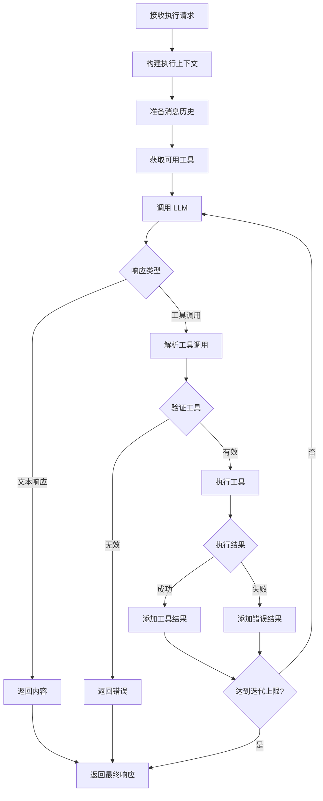
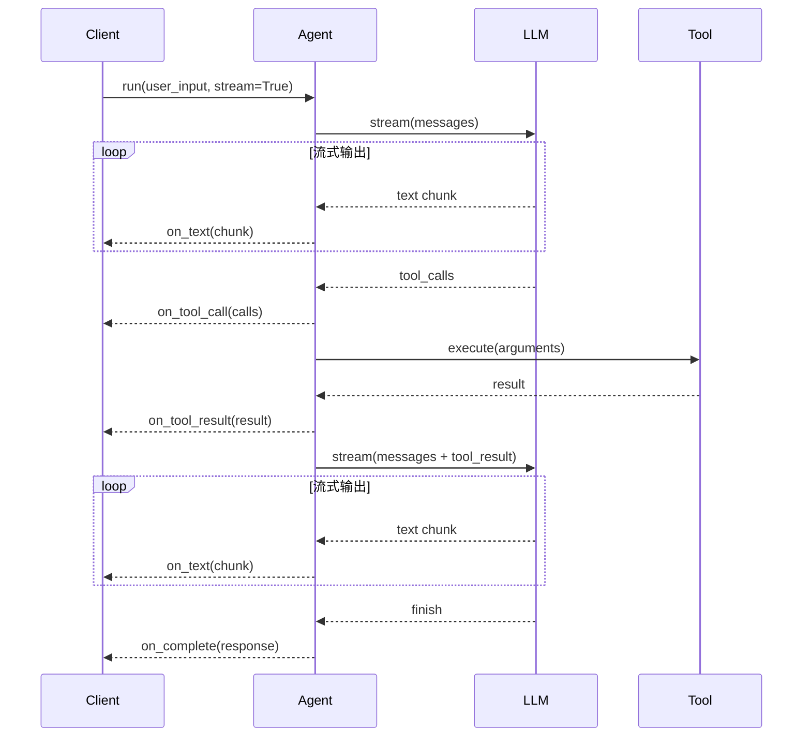

# Agent 执行流程

## 流程概述

Agent 执行流程是 TigerClaw 处理用户请求的核心流程，协调 LLM 调用和工具执行，生成最终响应。

## 流程图



## 详细流程步骤

### 步骤 1: 接收执行请求

**输入参数**:

| 参数 | 类型 | 必填 | 说明 |
|------|------|------|------|
| user_input | string | 是 | 用户输入内容 |
| stream | bool | 否 | 是否流式响应，默认 true |
| model | string | 否 | 指定模型，覆盖默认配置 |
| tools | list | 否 | 指定可用工具列表 |
| metadata | dict | 否 | 执行元数据 |

### 步骤 2: 构建执行上下文

**上下文内容**:
- 会话信息
- 用户信息
- 配置参数
- 回调函数

**上下文结构**:
```python
ExecutionContext(
    session_id="sess_xxx",
    user_id="user_xxx",
    request_id="req_xxx",
    config=RunConfig(
        model="gpt-4",
        temperature=0.7,
        max_tokens=4096,
        stream=True,
    ),
    callbacks={
        "on_text": callback,
        "on_tool_call": callback,
        "on_tool_result": callback,
    }
)
```

### 步骤 3: 准备消息历史

**消息构建**:
1. 添加系统提示
2. 添加历史消息
3. 添加当前用户消息

**消息格式**:
```python
messages = [
    {"role": "system", "content": "你是一个智能助手..."},
    {"role": "user", "content": "你好"},
    {"role": "assistant", "content": "你好！有什么可以帮助你的？"},
    {"role": "user", "content": "帮我查一下天气"},
]
```

**上下文长度检查**:
- 计算 Token 数量
- 超过阈值时触发压缩

### 步骤 4: 获取可用工具

**工具来源**:
1. 请求参数指定的工具
2. Agent 注册的默认工具
3. Skills 转换的工具

**工具格式转换**:
```python
openai_tools = [
    {
        "type": "function",
        "function": {
            "name": "get_weather",
            "description": "获取天气信息",
            "parameters": {
                "type": "object",
                "properties": {
                    "city": {"type": "string", "description": "城市名称"}
                },
                "required": ["city"]
            }
        }
    }
]
```

### 步骤 5: 调用 LLM

**调用参数**:
```python
CompletionParams(
    model="gpt-4",
    messages=messages,
    tools=openai_tools,
    temperature=0.7,
    max_tokens=4096,
    stream=True,
)
```

**流式响应处理**:
```python
async for chunk in provider.stream(params):
    if chunk.content:
        await callback.on_text(chunk.content)
    if chunk.tool_calls:
        await handle_tool_calls(chunk.tool_calls)
    if chunk.finish_reason:
        break
```

### 步骤 6: 处理响应类型

**响应类型判断**:

| 响应类型 | 判断条件 | 处理方式 |
|----------|----------|----------|
| 文本响应 | content 非空且无 tool_calls | 直接返回 |
| 工具调用 | tool_calls 非空 | 执行工具 |
| 空响应 | content 和 tool_calls 都为空 | 返回默认响应 |
| 错误 | finish_reason == "error" | 返回错误 |

### 步骤 7: 解析工具调用

**解析逻辑**:
```python
def parse_tool_calls(response) -> list[ToolCall]:
    return [
        ToolCall(
            id=tc["id"],
            name=tc["function"]["name"],
            arguments=json.loads(tc["function"]["arguments"]),
        )
        for tc in response.tool_calls
    ]
```

### 步骤 8: 验证工具

**验证内容**:
- 工具是否存在
- 参数是否符合 schema
- 是否有执行权限

**验证失败处理**:
```python
if not tool_exists:
    return ToolResult(
        call_id=call.id,
        name=call.name,
        output="Error: Tool not found",
        success=False,
    )
```

### 步骤 9: 执行工具

**执行方式**:
- 单个工具: 直接执行
- 多个工具: 并行执行

**执行超时**:
```python
result = await asyncio.wait_for(
    tool.execute(arguments, context),
    timeout=tool_timeout_ms / 1000,
)
```

### 步骤 10: 添加工具结果

**添加到上下文**:
```python
# 添加助手消息（工具调用）
context.add_assistant_message(
    content="",
    tool_calls=[tc.to_dict() for tc in tool_calls],
)

# 添加工具结果消息
for result in tool_results:
    context.add_tool_result(
        tool_call_id=result.call_id,
        name=result.name,
        content=result.output,
    )
```

### 步骤 11: 迭代控制

**迭代计数**:
```python
iteration_count += 1
if iteration_count >= max_tool_iterations:
    return AgentResponse(
        content="达到工具调用上限",
        finish_reason="tool_limit_reached",
    )
```

### 步骤 12: 返回最终响应

**响应结构**:
```python
AgentResponse(
    content="根据查询结果，北京今天天气晴朗...",
    tool_calls=tool_call_history,
    usage=Usage(
        input_tokens=500,
        output_tokens=200,
        total_tokens=700,
    ),
    finish_reason="stop",
    model="gpt-4",
    latency_ms=2500,
)
```

## 流式执行流程

### 流式响应序列图



## 错误处理

### 错误类型

| 错误类型 | 触发条件 | 处理方式 |
|----------|----------|----------|
| LLMError | LLM 调用失败 | 重试或返回错误 |
| ToolNotFoundError | 工具不存在 | 返回工具错误 |
| ToolExecutionError | 工具执行失败 | 记录错误，继续执行 |
| TimeoutError | 执行超时 | 返回超时错误 |
| ContextOverflowError | 上下文溢出 | 触发压缩 |

### 错误恢复策略

```python
async def execute_with_retry(agent, input, max_retries=3):
    for attempt in range(max_retries):
        try:
            return await agent.run(input)
        except LLMError as e:
            if attempt == max_retries - 1:
                raise
            await asyncio.sleep(2 ** attempt)  # 指数退避
```

## 性能优化

### 并行工具执行

```python
async def execute_tools_parallel(calls: list[ToolCall]) -> list[ToolResult]:
    tasks = [execute_tool(call) for call in calls]
    return await asyncio.gather(*tasks, return_exceptions=True)
```

### 上下文缓存

- 缓存常用系统提示
- 缓存工具定义
- 缓存嵌入向量

### 流式响应优化

- 使用异步生成器
- 减少内存占用
- 及时发送数据块

## 监控指标

| 指标 | 说明 | 目标值 |
|------|------|--------|
| execution_latency | 执行延迟 | < 5s |
| tool_execution_time | 工具执行时间 | < 2s |
| token_usage | Token 使用量 | 监控 |
| iteration_count | 迭代次数 | < 5 |

## 相关流程

- [工具执行流程](./tool-execution.md)
- [上下文管理流程](./context-management.md)
- [消息处理流程](../../session/flows/message-processing.md)
