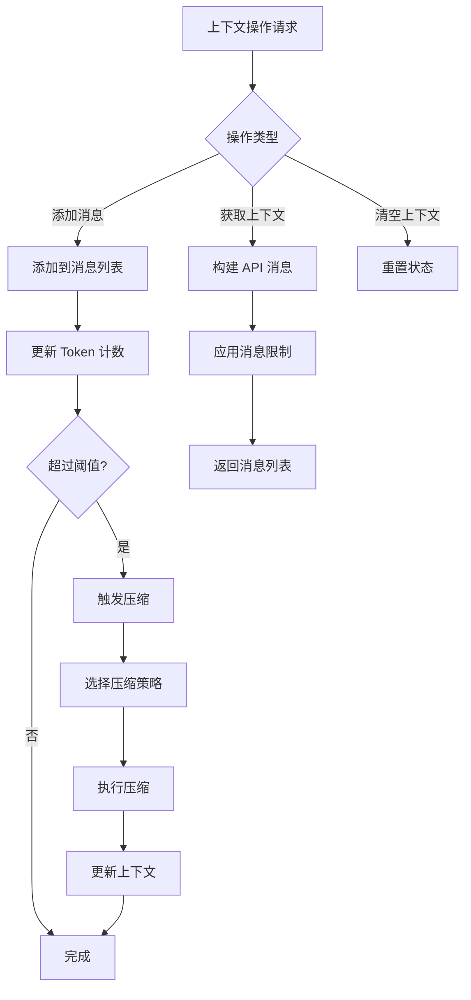

# 上下文管理流程

## 流程概述

上下文管理流程负责维护 Agent 的对话上下文，包括消息历史、Token 计数和上下文压缩。

## 流程图



## 核心功能

### 消息管理

**添加消息**:
```python
def add_message(self, role: str, content: str, metadata: dict = None):
    message = Message(
        role=role,
        content=content,
        created_at=datetime.utcnow(),
        metadata=metadata or {},
    )
    self._messages.append(message)
    self._update_token_count(message)
```

**消息类型**:

| 角色 | 说明 | 使用场景 |
|------|------|----------|
| system | 系统提示 | 设置 Agent 行为 |
| user | 用户消息 | 用户输入 |
| assistant | 助手消息 | Agent 响应 |
| tool | 工具结果 | 工具执行结果 |

### Token 计数

**计数方法**:
```python
def count_tokens(self, messages: list[Message]) -> int:
    total = 0
    for message in messages:
        total += self._count_message_tokens(message)
    return total

def _count_message_tokens(self, message: Message) -> int:
    # 使用 tiktoken 或估算
    content = message.content
    return len(content) // 4  # 简单估算
```

**Token 限制**:

| 模型 | 上下文窗口 | 建议最大 Token |
|------|------------|----------------|
| gpt-4 | 8K | 6,000 |
| gpt-4-turbo | 128K | 100,000 |
| claude-3-opus | 200K | 150,000 |

### 上下文压缩

**压缩触发条件**:
```python
def should_compress(self) -> bool:
    threshold = self._model_context_window * 0.9
    return self._token_count > threshold
```

**压缩策略**:

| 策略 | 说明 | 适用场景 |
|------|------|----------|
| truncate | 删除最早消息 | 简单对话 |
| summarize | 生成摘要 | 长对话 |
| sliding_window | 滑动窗口 | 固定长度 |

## 详细流程步骤

### 步骤 1: 添加系统提示

**设置系统提示**:
```python
def set_system_prompt(self, prompt: str):
    self._system_prompt = prompt
    self._messages = [
        msg for msg in self._messages
        if msg.role != "system"
    ]
    self._messages.insert(0, Message(
        role="system",
        content=prompt,
    ))
```

### 步骤 2: 添加用户消息

**添加用户输入**:
```python
def add_user_message(self, content: str, metadata: dict = None):
    self.add_message("user", content, metadata)
```

### 步骤 3: 添加助手消息

**添加 Agent 响应**:
```python
def add_assistant_message(
    self,
    content: str,
    tool_calls: list[dict] = None,
    metadata: dict = None,
):
    message = Message(
        role="assistant",
        content=content,
        metadata={
            **(metadata or {}),
            "tool_calls": tool_calls,
        }
    )
    self._messages.append(message)
```

### 步骤 4: 添加工具结果

**添加工具执行结果**:
```python
def add_tool_result(
    self,
    tool_call_id: str,
    name: str,
    content: str,
):
    message = Message(
        role="tool",
        content=content,
        metadata={
            "tool_call_id": tool_call_id,
            "name": name,
        }
    )
    self._messages.append(message)
```

### 步骤 5: 构建 API 消息

**转换为 API 格式**:
```python
def get_messages_for_api(self) -> list[dict]:
    api_messages = []
    
    for message in self._messages:
        api_message = {
            "role": message.role,
            "content": message.content,
        }
        
        if message.role == "tool":
            api_message["tool_call_id"] = message.metadata.get("tool_call_id")
        
        if message.role == "assistant" and message.metadata.get("tool_calls"):
            api_message["tool_calls"] = message.metadata["tool_calls"]
        
        api_messages.append(api_message)
    
    return api_messages
```

### 步骤 6: 上下文压缩

**截断策略**:
```python
def compress_truncate(self, max_tokens: int):
    while self._token_count > max_tokens and len(self._messages) > 2:
        # 保留系统提示和最近消息
        self._messages.pop(1)  # 删除第二条消息
        self._recalculate_token_count()
```

**摘要策略**:
```python
async def compress_summarize(self, llm_provider):
    # 获取需要摘要的消息
    old_messages = self._messages[1:-4]  # 保留系统提示和最近消息
    
    # 生成摘要
    summary = await llm_provider.complete([
        {"role": "system", "content": "请总结以下对话内容："},
        {"role": "user", "content": str(old_messages)},
    ])
    
    # 替换为摘要
    summary_message = Message(
        role="system",
        content=f"[历史对话摘要]\n{summary.content}",
        metadata={"type": "summary"},
    )
    
    self._messages = [self._messages[0]] + [summary_message] + self._messages[-4:]
```

### 步骤 7: 清空上下文

**重置状态**:
```python
def clear(self):
    system_prompt = self._system_prompt
    self._messages = []
    self._token_count = 0
    
    if system_prompt:
        self.set_system_prompt(system_prompt)
```

## 上下文状态

### 状态属性

```python
@dataclass
class ContextState:
    message_count: int
    token_count: int
    max_tokens: int
    compression_count: int
    last_compression_at: datetime | None
```

### 状态监控

```python
def get_state(self) -> ContextState:
    return ContextState(
        message_count=len(self._messages),
        token_count=self._token_count,
        max_tokens=self._model_context_window,
        compression_count=self._compression_count,
        last_compression_at=self._last_compression_at,
    )
```

## 压缩策略详解

### Truncate 策略

**特点**:
- 简单直接
- 删除最早的消息
- 可能丢失重要上下文

**适用场景**:
- 简单问答
- 不需要历史上下文

### Summarize 策略

**特点**:
- 保留关键信息
- 需要 LLM 调用
- 增加延迟

**适用场景**:
- 长对话
- 需要保持上下文连贯性

### Sliding Window 策略

**特点**:
- 固定窗口大小
- 平衡性能和上下文

**实现**:
```python
def compress_sliding_window(self, window_size: int):
    if len(self._messages) <= window_size:
        return
    
    # 保留系统提示
    system_messages = [m for m in self._messages if m.role == "system"]
    
    # 保留最近 N 条消息
    recent_messages = self._messages[-window_size:]
    
    self._messages = system_messages + recent_messages
    self._recalculate_token_count()
```

## 配置

```yaml
context:
  max_tokens: 4096
  compression:
    enabled: true
    threshold: 0.9  # 90% 时触发
    strategy: "summarize"  # truncate, summarize, sliding_window
    preserve_recent: 4  # 保留最近 N 条消息
```

## 性能优化

### Token 计数缓存

```python
class ContextManager:
    def __init__(self):
        self._token_cache: dict[str, int] = {}
    
    def _count_message_tokens(self, message: Message) -> int:
        cache_key = hash(message.content)
        if cache_key in self._token_cache:
            return self._token_cache[cache_key]
        
        count = self._tokenizer.count(message.content)
        self._token_cache[cache_key] = count
        return count
```

### 增量更新

```python
def add_message(self, role: str, content: str, metadata: dict = None):
    message = Message(...)
    self._messages.append(message)
    
    # 增量更新 Token 计数
    self._token_count += self._count_message_tokens(message)
```

## 相关流程

- [Agent 执行流程](./agent-execution.md)
- [消息处理流程](../../session/flows/message-processing.md)
