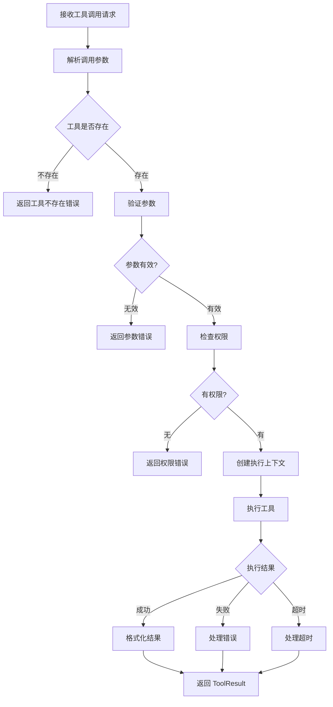
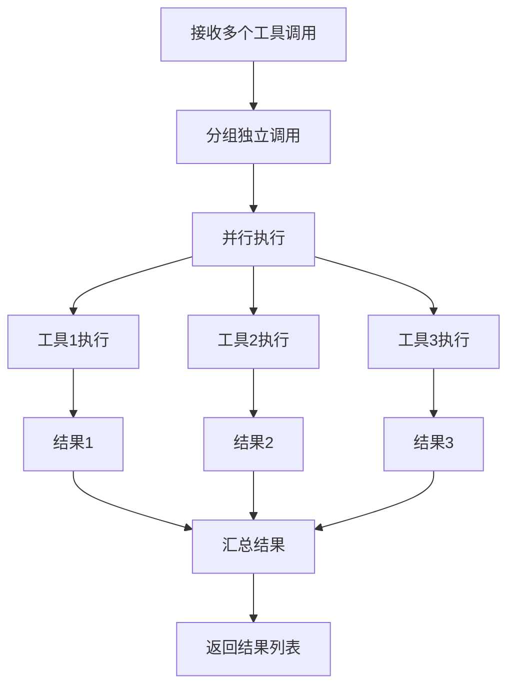

# 工具执行流程

## 流程概述

工具执行流程处理 Agent 发起的工具调用请求，执行工具并返回结果。

## 流程图



## 详细流程步骤

### 步骤 1: 接收工具调用请求

**输入格式**:
```json
{
  "id": "call_abc123",
  "type": "function",
  "function": {
    "name": "get_weather",
    "arguments": "{\"city\": \"北京\"}"
  }
}
```

### 步骤 2: 解析调用参数

**解析逻辑**:
```python
def parse_tool_call(raw_call: dict) -> ToolCall:
    return ToolCall(
        id=raw_call["id"],
        name=raw_call["function"]["name"],
        arguments=json.loads(raw_call["function"]["arguments"]),
    )
```

### 步骤 3: 工具存在性检查

**检查逻辑**:
```python
tool = tool_registry.get(call.name)
if tool is None:
    return ToolResult(
        call_id=call.id,
        name=call.name,
        output=f"Error: Tool '{call.name}' not found",
        success=False,
    )
```

### 步骤 4: 参数验证

**验证方式**:
- JSON Schema 验证
- 类型检查
- 必填字段检查
- 值范围检查

**验证示例**:
```python
def validate_arguments(tool: Tool, arguments: dict) -> ValidationResult:
    schema = tool.definition.parameters_schema
    
    # 检查必填字段
    for param in tool.definition.parameters:
        if param.required and param.name not in arguments:
            return ValidationResult(
                valid=False,
                error=f"Missing required parameter: {param.name}"
            )
    
    # 类型检查
    for name, value in arguments.items():
        param = find_parameter(tool, name)
        if not validate_type(value, param.type):
            return ValidationResult(
                valid=False,
                error=f"Invalid type for {name}: expected {param.type}"
            )
    
    return ValidationResult(valid=True)
```

### 步骤 5: 权限检查

**权限级别**:

| 级别 | 说明 | 示例工具 |
|------|------|----------|
| read | 只读操作 | get_weather, search |
| write | 写入操作 | create_file, update_record |
| execute | 执行操作 | run_command, execute_code |
| admin | 管理操作 | delete_all, system_config |

**权限检查逻辑**:
```python
def check_permission(tool: Tool, context: ToolContext) -> bool:
    required_level = tool.definition.permission_level
    user_level = context.user_permission_level
    
    level_order = ["read", "write", "execute", "admin"]
    return level_order.index(user_level) >= level_order.index(required_level)
```

### 步骤 6: 创建执行上下文

**上下文内容**:
```python
ToolContext(
    tool_call_id=call.id,
    session_id=session_id,
    user_id=user_id,
    workspace_dir=workspace_dir,
    config=tool_config,
    metadata={
        "request_id": request_id,
        "timestamp": datetime.utcnow(),
    }
)
```

### 步骤 7: 执行工具

**执行方式**:

**同步执行**:
```python
result = await tool.execute(arguments, context)
```

**带超时执行**:
```python
try:
    result = await asyncio.wait_for(
        tool.execute(arguments, context),
        timeout=tool_timeout_seconds,
    )
except asyncio.TimeoutError:
    result = ToolResult(
        call_id=call.id,
        name=call.name,
        output="Error: Tool execution timed out",
        success=False,
    )
```

### 步骤 8: 处理执行结果

**成功结果**:
```python
ToolResult(
    call_id=call.id,
    name=call.name,
    output=json.dumps(result_data),
    success=True,
    metadata={
        "execution_time_ms": 150,
    }
)
```

**失败结果**:
```python
ToolResult(
    call_id=call.id,
    name=call.name,
    output=f"Error: {str(exception)}",
    success=False,
    metadata={
        "error_type": type(exception).__name__,
    }
)
```

## 并行执行

### 并行执行流程



### 并行执行实现

```python
async def execute_tools_parallel(
    calls: list[ToolCall],
    context: ToolContext,
) -> list[ToolResult]:
    tasks = [
        execute_single_tool(call, context)
        for call in calls
    ]
    
    results = await asyncio.gather(*tasks, return_exceptions=True)
    
    return [
        result if isinstance(result, ToolResult)
        else ToolResult(
            call_id=call.id,
            name=call.name,
            output=str(result),
            success=False,
        )
        for call, result in zip(calls, results)
    ]
```

### 依赖检测

**检测逻辑**:
```python
def detect_dependencies(calls: list[ToolCall]) -> list[list[ToolCall]]:
    """检测工具间的依赖关系，返回执行批次"""
    batches = []
    remaining = calls.copy()
    resolved_outputs = set()
    
    while remaining:
        # 找出没有依赖的调用
        batch = [
            call for call in remaining
            if not has_dependency(call, resolved_outputs)
        ]
        
        if not batch:
            # 存在循环依赖
            raise CircularDependencyError()
        
        batches.append(batch)
        
        # 更新已解析的输出
        for call in batch:
            resolved_outputs.add(call.output_name)
            remaining.remove(call)
    
    return batches
```

## 工具类型处理

### 内置工具

| 工具名 | 类别 | 说明 |
|--------|------|------|
| echo | utility | 回显测试 |
| get_current_time | utility | 获取当前时间 |

### 自定义工具

**注册方式**:
```python
@tool_registry.register
class MyCustomTool(ToolBase):
    name = "my_tool"
    description = "自定义工具"
    
    parameters = [
        ToolParameter(
            name="input",
            type="string",
            description="输入参数",
            required=True,
        ),
    ]
    
    async def execute(self, arguments: dict, context: ToolContext) -> Any:
        return f"处理结果: {arguments['input']}"
```

### 技能转换工具

Skills 自动转换为工具：
```python
# Skill 定义
class WeatherSkill(SkillBase):
    name = "get_weather"
    description = "获取天气"
    parameters = [...]

# 自动转换为 Tool
tool = skill_to_tool(weather_skill)
tool_registry.register(tool)
```

## 错误处理

### 错误类型

| 错误类型 | 说明 | 处理方式 |
|----------|------|----------|
| ToolNotFoundError | 工具不存在 | 返回错误结果 |
| ValidationError | 参数验证失败 | 返回错误结果 |
| PermissionError | 权限不足 | 返回错误结果 |
| TimeoutError | 执行超时 | 返回超时结果 |
| ExecutionError | 执行异常 | 返回错误结果 |

### 错误结果格式

```json
{
  "call_id": "call_abc123",
  "name": "get_weather",
  "output": "Error: Connection timeout after 30 seconds",
  "success": false,
  "metadata": {
    "error_type": "TimeoutError",
    "error_code": "TOOL_TIMEOUT",
    "execution_time_ms": 30000
  }
}
```

## 审计日志

### 日志内容

```json
{
  "timestamp": "2024-01-15T10:30:00Z",
  "action": "tool_execution",
  "tool_name": "get_weather",
  "call_id": "call_abc123",
  "session_id": "sess_xxx",
  "user_id": "user_xxx",
  "arguments": {"city": "北京"},
  "result": "success",
  "execution_time_ms": 150,
  "metadata": {}
}
```

### 敏感信息处理

- 不记录敏感参数值
- 对输出进行脱敏
- 保留必要审计信息

## 配置

```yaml
tools:
  execution:
    timeout_ms: 30000
    max_parallel: 5
    retry_count: 0
  
  validation:
    strict_mode: true
    allow_extra_params: false
  
  audit:
    enabled: true
    log_arguments: true
    log_results: true
```

## 相关流程

- [Agent 执行流程](./agent-execution.md)
- [上下文管理流程](./context-management.md)
