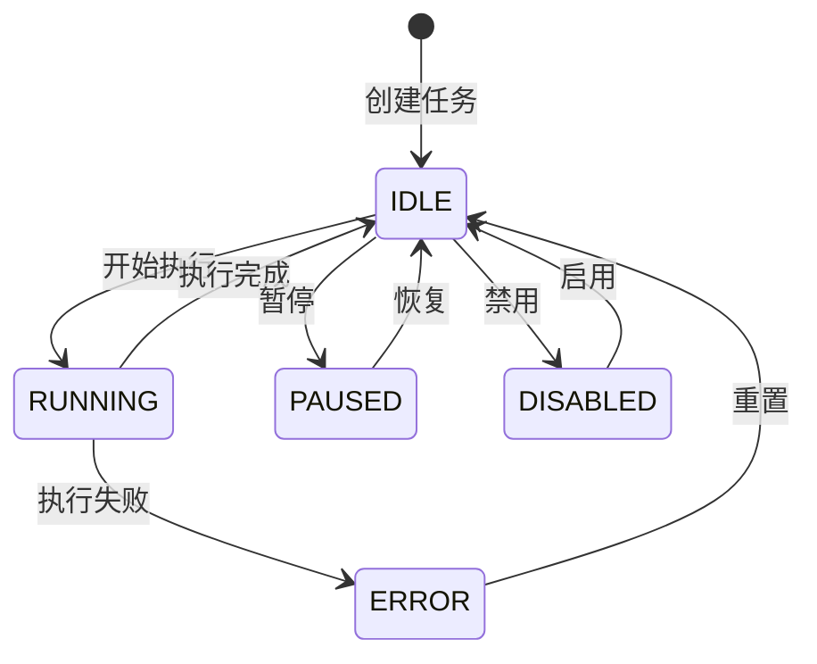
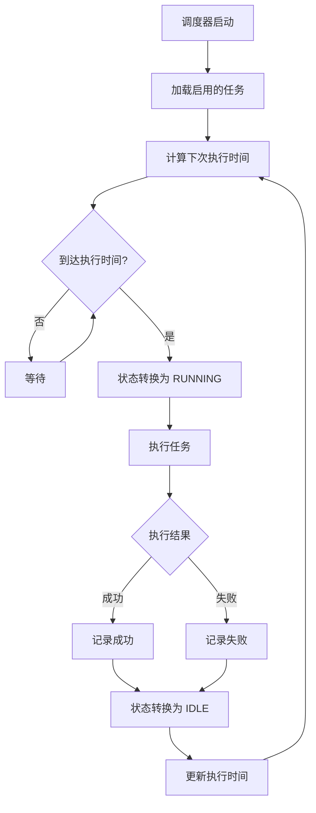
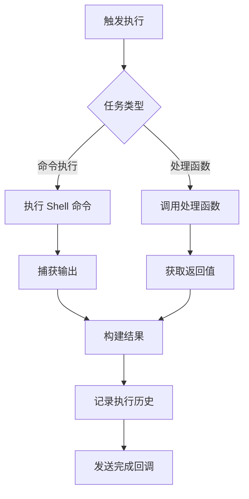

# Cron 领域业务逻辑

## 概述

Cron 领域负责定时任务的调度与执行，支持 Cron 表达式和任务持久化。

## 业务实体

### CronJob

定时任务实体。

| 属性 | 类型 | 说明 |
|------|------|------|
| id | string | 任务唯一标识 |
| name | string | 任务名称 |
| schedule | string | Cron 表达式 |
| command | string | 执行命令 |
| enabled | bool | 是否启用 |
| status | JobStatus | 任务状态 |
| last_run | datetime | 最后执行时间 |
| next_run | datetime | 下次执行时间 |

### JobExecutionResult

执行结果实体。

| 属性 | 类型 | 说明 |
|------|------|------|
| job_id | string | 任务 ID |
| success | bool | 是否成功 |
| output | string | 输出内容 |
| error | string | 错误信息 |
| started_at | datetime | 开始时间 |
| finished_at | datetime | 结束时间 |
| duration_ms | int | 执行时长 |

## 状态机

### JobStatus 定义

| 状态 | 说明 | 允许的转换 |
|------|------|------------|
| IDLE | 空闲 | → RUNNING |
| RUNNING | 运行中 | → IDLE, → ERROR |
| PAUSED | 已暂停 | → IDLE |
| ERROR | 错误 | → IDLE |
| DISABLED | 已禁用 | → IDLE |

### 状态转换图



## 核心业务流程

### 任务调度流程



### 任务执行流程



## 业务规则

### CR-001: Cron 表达式验证

**规则描述**: 任务创建时验证 Cron 表达式格式。

**有效格式**: 5 字段标准 Cron 表达式

```
┌───────────── 分钟 (0 - 59)
│ ┌───────────── 小时 (0 - 23)
│ │ ┌───────────── 日 (1 - 31)
│ │ │ ┌───────────── 月 (1 - 12)
│ │ │ │ ┌───────────── 星期 (0 - 6)
│ │ │ │ │
* * * * *
```

### CR-002: 执行超时

**规则描述**: 任务执行有超时限制。

**参数**: `execution_timeout_ms`，默认 3600000ms (1小时)

### CR-003: 重试策略

**规则描述**: 失败任务可配置重试。

**参数**:
- `max_retries`: 最大重试次数
- `retry_delay_ms`: 重试间隔

### CR-004: 并发控制

**规则描述**: 同一任务不能并发执行。

**处理方式**: 跳过本次执行，记录日志

## 配置

```yaml
cron:
  db_path: "./data/cron.db"
  max_history: 100
  default_timeout: 3600000
  timezone: "Asia/Shanghai"
```

## 关键代码位置

| 功能 | 文件路径 | 核心类/函数 |
|------|----------|-------------|
| 任务服务 | `src/tigerclaw/cron/service.py` | `CronService` |
| 任务调度 | `src/tigerclaw/cron/scheduler.py` | `JobScheduler` |
| 任务存储 | `src/tigerclaw/cron/store.py` | `JobStore` |
