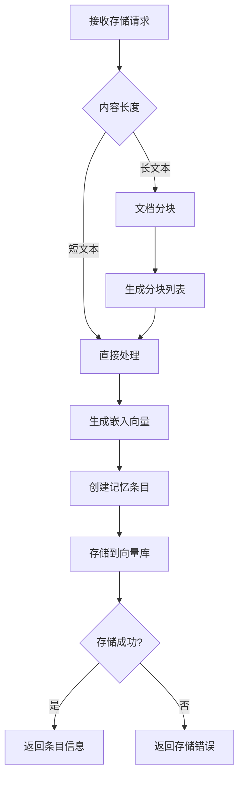
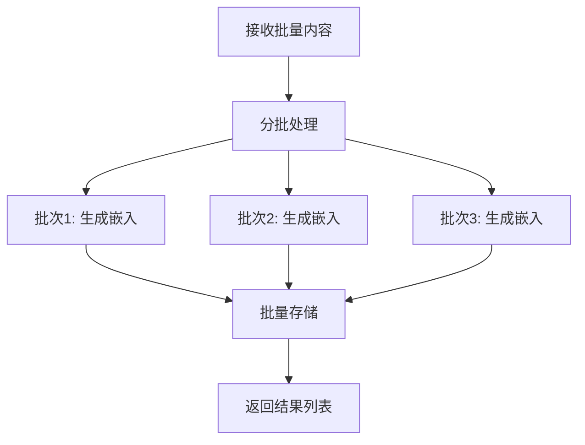

# 记忆存储流程

## 流程概述

记忆存储流程将文本内容转换为向量嵌入并存储到向量数据库中。

## 流程图



## 详细流程步骤

### 步骤 1: 接收存储请求

**请求参数**:

| 参数 | 类型 | 必填 | 说明 |
|------|------|------|------|
| content | string | 是 | 记忆内容 |
| metadata | dict | 否 | 元数据 |
| entry_id | string | 否 | 自定义 ID |

### 步骤 2: 内容分块

**分块逻辑**:
```python
def chunk_content(
    content: str,
    chunk_size: int = 1000,
    overlap: int = 200,
) -> list[str]:
    chunks = []
    start = 0
    
    while start < len(content):
        end = start + chunk_size
        chunk = content[start:end]
        chunks.append(chunk)
        start = end - overlap
    
    return chunks
```

### 步骤 3: 生成嵌入向量

**嵌入生成**:
```python
async def generate_embedding(content: str) -> list[float]:
    response = await embedding_client.embed(
        model="text-embedding-ada-002",
        input=content,
    )
    return response.embedding
```

### 步骤 4: 创建记忆条目

**条目创建**:
```python
entry = MemoryEntry(
    id=entry_id or generate_uuid(),
    content=content,
    embedding=embedding,
    metadata=metadata or {},
    created_at=datetime.utcnow(),
)
```

### 步骤 5: 存储到向量库

**存储操作**:
```python
async def store_entry(entry: MemoryEntry):
    await vector_store.upsert(
        id=entry.id,
        vector=entry.embedding,
        metadata={
            "content": entry.content,
            **entry.metadata,
        },
    )
```

## 批量存储

### 批量处理流程



### 批量嵌入生成

```python
async def generate_embeddings_batch(
    contents: list[str],
    batch_size: int = 100,
) -> list[list[float]]:
    embeddings = []
    
    for i in range(0, len(contents), batch_size):
        batch = contents[i:i + batch_size]
        batch_embeddings = await embedding_client.embed_batch(batch)
        embeddings.extend(batch_embeddings)
    
    return embeddings
```

## 配置

```yaml
memory:
  embedding:
    model: "text-embedding-ada-002"
    dimensions: 1536
    batch_size: 100
  
  chunking:
    chunk_size: 1000
    chunk_overlap: 200
  
  storage:
    db_path: "./data/memories.db"
```

## 相关流程

- [语义检索流程](./semantic-search.md)
