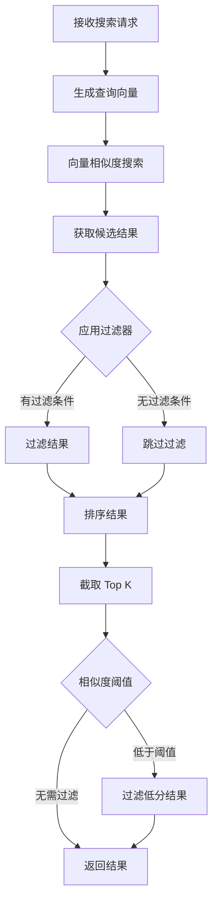
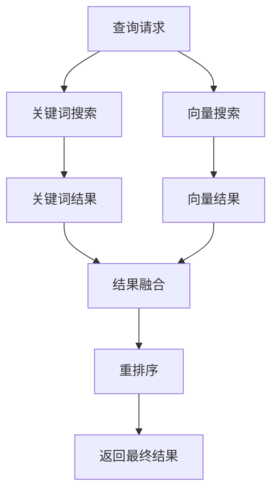

# 语义检索流程

## 流程概述

语义检索流程根据查询文本搜索相似的记忆条目，返回相关结果。

## 流程图



## 详细流程步骤

### 步骤 1: 接收搜索请求

**请求参数**:

| 参数 | 类型 | 必填 | 说明 |
|------|------|------|------|
| query | string | 是 | 查询文本 |
| top_k | int | 否 | 返回数量，默认 5 |
| threshold | float | 否 | 相似度阈值，默认 0.0 |
| filters | dict | 否 | 元数据过滤条件 |

### 步骤 2: 生成查询向量

**向量生成**:
```python
query_embedding = await embedding_generator.embed(query)
```

### 步骤 3: 向量相似度搜索

**搜索实现**:
```python
def vector_search(
    query_vector: list[float],
    entries: list[MemoryEntry],
    top_k: int,
) -> list[tuple[MemoryEntry, float]]:
    results = []
    
    for entry in entries:
        similarity = cosine_similarity(query_vector, entry.embedding)
        results.append((entry, similarity))
    
    results.sort(key=lambda x: x[1], reverse=True)
    return results[:top_k]
```

### 步骤 4: 相似度计算

**余弦相似度**:
```python
def cosine_similarity(a: list[float], b: list[float]) -> float:
    dot_product = sum(x * y for x, y in zip(a, b))
    norm_a = sum(x ** 2 for x in a) ** 0.5
    norm_b = sum(x ** 2 for x in b) ** 0.5
    
    if norm_a == 0 or norm_b == 0:
        return 0.0
    
    return dot_product / (norm_a * norm_b)
```

### 步骤 5: 过滤结果

**元数据过滤**:
```python
def apply_filters(
    results: list[tuple[MemoryEntry, float]],
    filters: dict[str, Any],
) -> list[tuple[MemoryEntry, float]]:
    filtered = []
    
    for entry, score in results:
        match = True
        for key, value in filters.items():
            if entry.metadata.get(key) != value:
                match = False
                break
        
        if match:
            filtered.append((entry, score))
    
    return filtered
```

### 步骤 6: 返回结果

**结果格式**:
```python
SearchResult(
    entry=MemoryEntry(...),
    score=0.85,
    highlights=["相关片段1", "相关片段2"],
)
```

## 混合搜索

### 混合搜索策略

结合关键词搜索和向量搜索：



### 结果融合

```python
def hybrid_search(
    query: str,
    top_k: int = 5,
    keyword_weight: float = 0.3,
    vector_weight: float = 0.7,
) -> list[SearchResult]:
    # 关键词搜索
    keyword_results = keyword_search(query, top_k * 2)
    
    # 向量搜索
    vector_results = vector_search(query, top_k * 2)
    
    # 融合分数
    combined = {}
    for result in keyword_results:
        combined[result.entry.id] = {
            "entry": result.entry,
            "keyword_score": result.score,
            "vector_score": 0,
        }
    
    for result in vector_results:
        if result.entry.id in combined:
            combined[result.entry.id]["vector_score"] = result.score
        else:
            combined[result.entry.id] = {
                "entry": result.entry,
                "keyword_score": 0,
                "vector_score": result.score,
            }
    
    # 计算加权分数
    results = []
    for item in combined.values():
        score = (
            keyword_weight * item["keyword_score"] +
            vector_weight * item["vector_score"]
        )
        results.append(SearchResult(
            entry=item["entry"],
            score=score,
        ))
    
    results.sort(key=lambda x: x.score, reverse=True)
    return results[:top_k]
```

## 配置

```yaml
memory:
  search:
    default_top_k: 5
    similarity_threshold: 0.0
    hybrid_search:
      enabled: false
      keyword_weight: 0.3
      vector_weight: 0.7
```

## 相关流程

- [记忆存储流程](./memory-storage.md)
