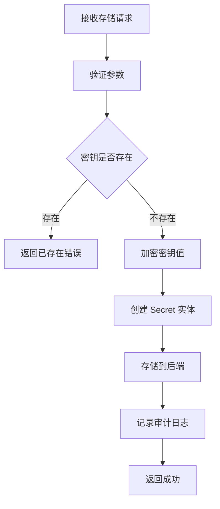
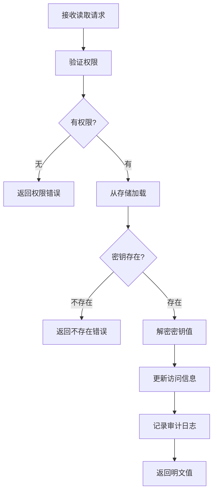
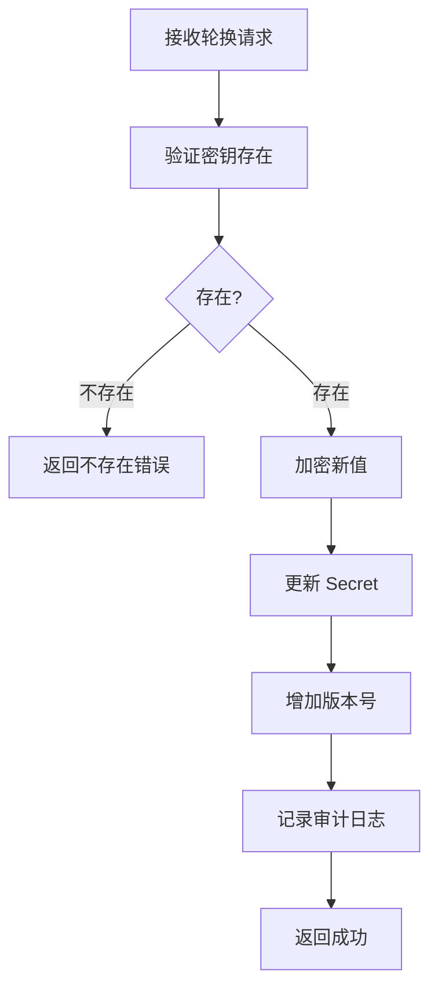

# Secrets 领域业务逻辑

## 概述

Secrets 领域负责敏感信息的安全存储与管理，支持加密存储、命名空间隔离和访问审计。

## 业务实体

### Secret

密钥实体。

| 属性 | 类型 | 说明 |
|------|------|------|
| key | string | 密钥名称 |
| encrypted_value | bytes | 加密后的值 |
| namespace | string | 命名空间 |
| version | int | 版本号 |
| created_at | datetime | 创建时间 |
| updated_at | datetime | 更新时间 |
| metadata | dict | 元数据 |

### AuditEntry

审计日志实体。

| 属性 | 类型 | 说明 |
|------|------|------|
| action | SecretAction | 操作类型 |
| key | string | 密钥名称 |
| namespace | string | 命名空间 |
| user | string | 操作用户 |
| success | bool | 是否成功 |
| timestamp | datetime | 操作时间 |

## 操作类型

### SecretAction

| 操作 | 说明 | 审计级别 |
|------|------|----------|
| CREATE | 创建密钥 | HIGH |
| READ | 读取密钥 | MEDIUM |
| UPDATE | 更新密钥 | HIGH |
| DELETE | 删除密钥 | HIGH |
| LIST | 列出密钥 | LOW |
| ROTATE | 轮换密钥 | HIGH |

## 核心业务流程

### 密钥存储流程



### 密钥读取流程



### 密钥轮换流程



## 业务规则

### SEC-001: 加密存储

**规则描述**: 所有密钥值必须加密后存储。

**实现**: 使用 Fernet 对称加密

### SEC-002: 命名空间隔离

**规则描述**: 不同命名空间的密钥相互隔离。

**默认命名空间**: `default`

### SEC-003: 访问审计

**规则描述**: 所有密钥操作必须记录审计日志。

**记录内容**:
- 操作类型
- 操作时间
- 操作用户
- 操作结果

### SEC-004: 版本控制

**规则描述**: 密钥更新时自动增加版本号。

**用途**: 支持密钥轮换追踪

## 配置

```yaml
secrets:
  store:
    type: "file"  # memory, file
    path: "./data/secrets"
  
  encryption:
    key_file: "./keys/secrets.key"
  
  audit:
    enabled: true
    retention_days: 90
```

## 关键代码位置

| 功能 | 文件路径 | 核心类/函数 |
|------|----------|-------------|
| 密钥管理 | `src/tigerclaw/secrets/manager.py` | `SecretsManager` |
| 存储后端 | `src/tigerclaw/secrets/store.py` | `SecretStore` |
| 加密后端 | `src/tigerclaw/secrets/crypto.py` | `CryptoBackend` |
| 审计日志 | `src/tigerclaw/secrets/audit.py` | `AuditLog` |
