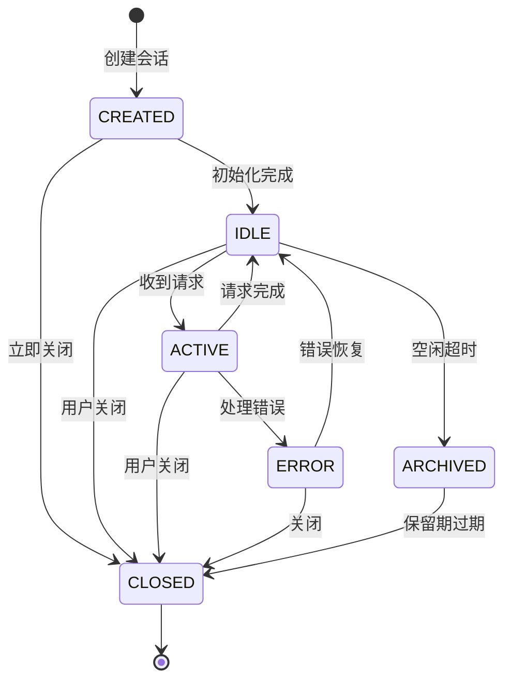
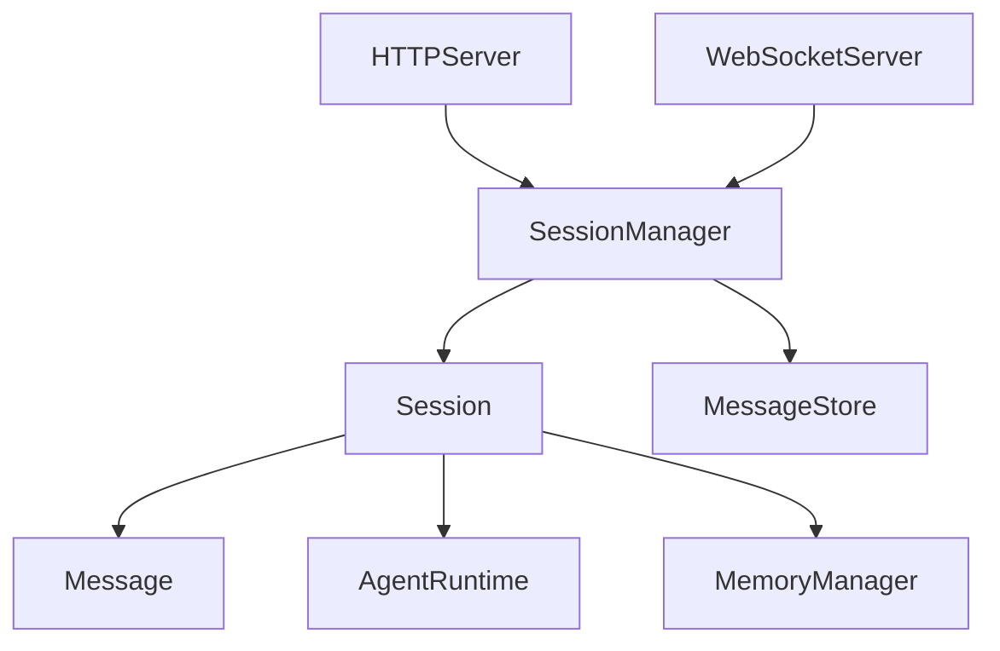

# Session 领域业务逻辑

## 概述

Session（会话）领域管理用户与 Agent 之间的交互上下文，是 TigerClaw 的核心业务领域之一。

## 业务实体

### Session

会话实体，包含以下属性：

| 属性 | 类型 | 说明 |
|------|------|------|
| session_id | string | 会话唯一标识 |
| agent_id | string | 关联的 Agent ID |
| state | SessionState | 会话状态 |
| created_at | datetime | 创建时间 |
| updated_at | datetime | 最后更新时间 |
| activated_at | datetime | 最后激活时间 |
| archived_at | datetime | 归档时间 |
| message_count | int | 消息数量 |
| model | string | 使用的模型 |

### Message

消息实体，包含以下属性：

| 属性 | 类型 | 说明 |
|------|------|------|
| id | string | 消息唯一标识 |
| session_id | string | 所属会话 ID |
| role | string | 消息角色 |
| content | string | 消息内容 |
| created_at | datetime | 创建时间 |
| metadata | dict | 元数据 |

## 状态机

### Session 状态定义

| 状态 | 说明 | 允许的转换 |
|------|------|------------|
| CREATED | 已创建，等待首次交互 | → IDLE, → CLOSED |
| IDLE | 空闲，等待用户输入 | → ACTIVE, → ARCHIVED, → CLOSED |
| ACTIVE | 活跃，正在处理请求 | → IDLE, → ERROR, → CLOSED |
| ARCHIVED | 已归档，不再活跃 | → CLOSED |
| CLOSED | 已关闭，资源已释放 | 无 |
| ERROR | 错误状态 | → IDLE, → CLOSED |

### 状态转换图

### 状态转换触发条件

| 转换 | 触发条件 | 动作 |
|------|----------|------|
| CREATED → IDLE | 初始化完成 | 设置 created_at |
| IDLE → ACTIVE | 收到用户请求 | 设置 activated_at |
| ACTIVE → IDLE | 请求处理完成 | 更新 updated_at |
| IDLE → ARCHIVED | 空闲超过阈值 | 设置 archived_at |
| ACTIVE → ERROR | 处理异常 | 记录错误信息 |
| * → CLOSED | 显式关闭或超时 | 释放资源 |

## 业务流程

### 会话创建流程

详见 [flows/session-creation.md](./flows/session-creation.md)

### 消息处理流程

详见 [flows/message-processing.md](./flows/message-processing.md)

### 会话清理流程

详见 [flows/session-cleanup.md](./flows/session-cleanup.md)

## 业务规则

### SR-001: 会话超时规则

**规则描述**: 空闲超过指定时间的会话自动转为归档状态。

**参数**:
- `idle_timeout_ms`: 空闲超时时间，默认 3600000ms (1小时)

**适用条件**:
- 会话状态为 IDLE
- 距离最后活动时间超过 idle_timeout_ms

**执行动作**:
- 状态转换为 ARCHIVED
- 设置 archived_at 时间戳

### SR-002: 消息保留规则

**规则描述**: 归档会话的消息在保留期后自动清理。

**参数**:
- `archive_retention_days`: 归档保留天数，默认 30 天

**适用条件**:
- 会话状态为 ARCHIVED
- 距离归档时间超过 archive_retention_days

**执行动作**:
- 状态转换为 CLOSED
- 清理会话消息

### SR-003: 并发请求限制

**规则描述**: 单个会话同时只能有一个活跃请求。

**适用条件**:
- 会话状态为 ACTIVE
- 收到新的请求

**执行动作**:
- 拒绝新请求，返回错误
- 或排队等待当前请求完成

### SR-004: 消息数量限制

**规则描述**: 单个会话的消息数量有上限。

**参数**:
- `max_messages_per_session`: 最大消息数，默认 1000

**适用条件**:
- 添加新消息时
- 当前消息数量已达上限

**执行动作**:
- 触发上下文压缩
- 或拒绝新消息

## 关键代码位置

| 功能 | 文件路径 | 核心类/函数 |
|------|----------|-------------|
| 会话管理 | `src/tigerclaw/gateway/session_manager.py` | `SessionManager` |
| 会话实体 | `src/tigerclaw/gateway/session_manager.py` | `Session` |
| 消息实体 | `src/tigerclaw/gateway/session_manager.py` | `Message` |
| HTTP API | `src/tigerclaw/gateway/http_server.py` | `create_http_app` |
| WebSocket | `src/tigerclaw/gateway/websocket_server.py` | `WebSocketServer` |

## 依赖关系

