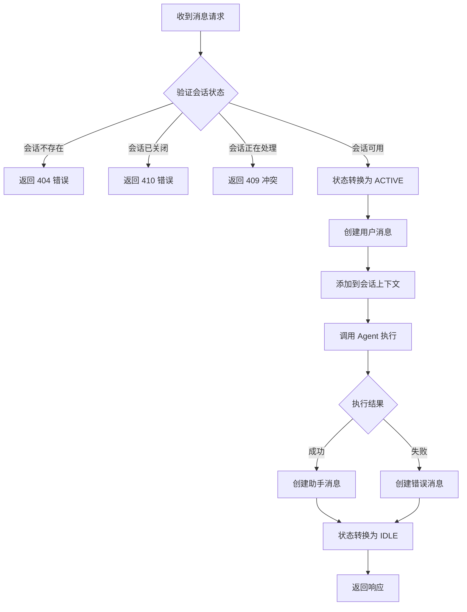
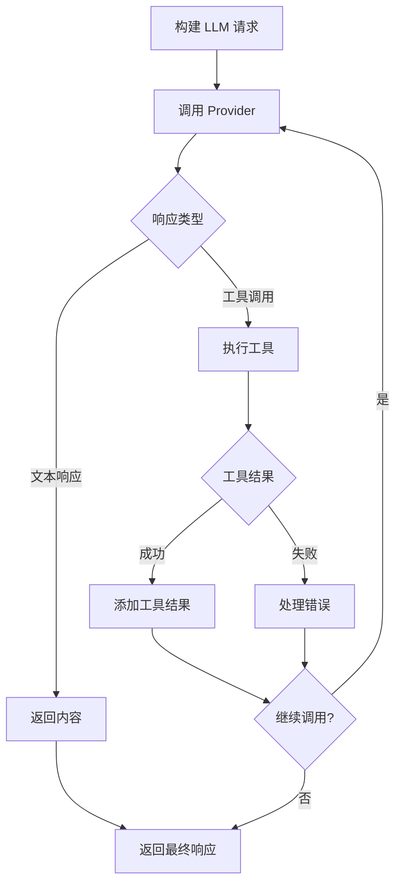
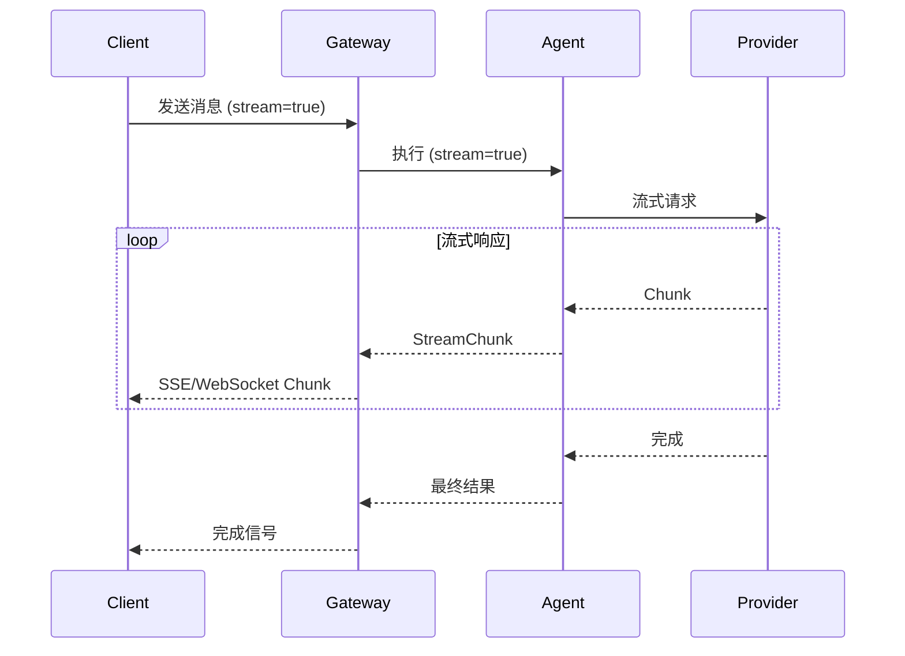
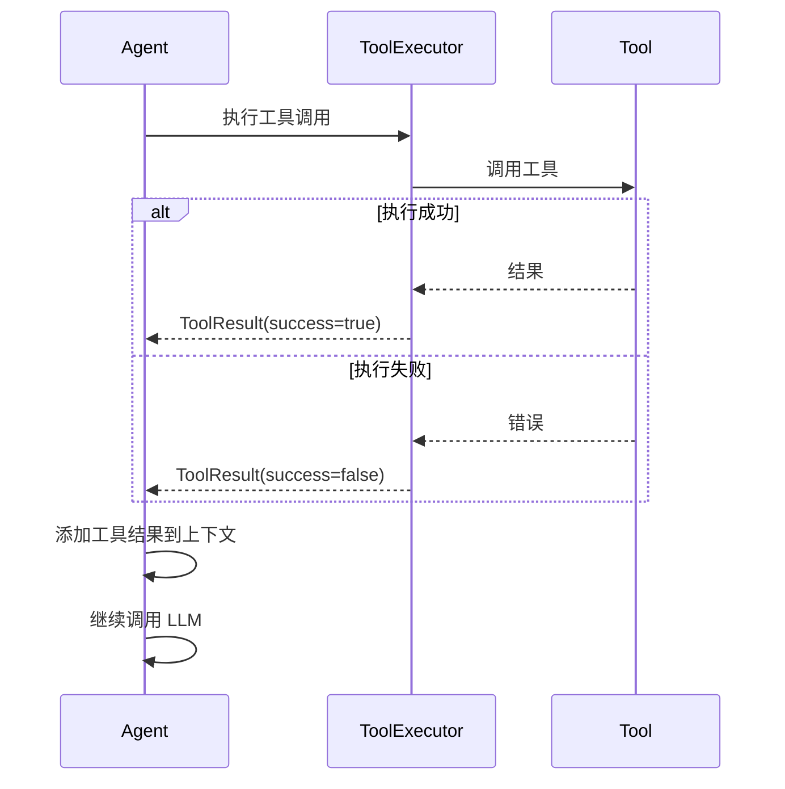

# 消息处理流程

## 流程概述

消息处理流程是 TigerClaw 的核心业务流程，处理用户发送的消息并返回 Agent 响应。

## 流程图



## 详细流程步骤

### 步骤 1: 接收消息请求

**触发条件**:
- HTTP POST `/sessions/{session_id}/messages`
- WebSocket 消息

**请求参数**:

| 参数 | 类型 | 必填 | 说明 |
|------|------|------|------|
| role | string | 否 | 消息角色，默认 "user" |
| content | string | 是 | 消息内容 |
| metadata | dict | 否 | 消息元数据 |

**示例请求**:
```json
{
  "role": "user",
  "content": "你好，请帮我分析这段代码",
  "metadata": {
    "source": "web",
    "attachments": ["file_id_123"]
  }
}
```

### 步骤 2: 会话状态验证

**验证规则**:

| 会话状态 | 处理方式 | HTTP 状态码 |
|----------|----------|-------------|
| IDLE | 允许处理 | - |
| ACTIVE | 拒绝（并发冲突） | 409 Conflict |
| ARCHIVED | 拒绝（会话已归档） | 410 Gone |
| CLOSED | 拒绝（会话已关闭） | 410 Gone |
| ERROR | 尝试恢复后处理 | - |

### 步骤 3: 状态转换

**转换**: IDLE → ACTIVE

**动作**:
- 设置 `activated_at`
- 获取并发锁

### 步骤 4: 创建用户消息

**消息实体**:

```python
Message(
    id="msg_xxx",
    session_id="sess_xxx",
    role="user",
    content="你好，请帮我分析这段代码",
    created_at=datetime.utcnow(),
    metadata={"source": "web"}
)
```

### 步骤 5: 添加到上下文

**上下文操作**:
- 添加用户消息到对话历史
- 检查上下文长度
- 必要时触发压缩

### 步骤 6: 调用 Agent 执行

**Agent 执行流程**:



### 步骤 7: 处理 Agent 响应

**响应类型**:

| 类型 | 说明 | 处理方式 |
|------|------|----------|
| 文本响应 | 直接返回文本内容 | 创建助手消息 |
| 工具调用 | 需要执行工具 | 执行工具后继续 |
| 错误 | 执行出错 | 创建错误消息 |

### 步骤 8: 创建助手消息

**消息实体**:

```python
Message(
    id="msg_yyy",
    session_id="sess_xxx",
    role="assistant",
    content="好的，我来帮你分析...",
    created_at=datetime.utcnow(),
    metadata={
        "model": "gpt-4",
        "usage": {"input_tokens": 100, "output_tokens": 200}
    }
)
```

### 步骤 9: 状态转换

**转换**: ACTIVE → IDLE

**动作**:
- 更新 `updated_at`
- 释放并发锁

### 步骤 10: 返回响应

**响应内容**:

```json
{
  "id": "msg_yyy",
  "session_id": "sess_xxx",
  "role": "assistant",
  "content": "好的，我来帮你分析...",
  "created_at": 1704067200.456,
  "metadata": {
    "model": "gpt-4",
    "usage": {
      "input_tokens": 100,
      "output_tokens": 200
    }
  }
}
```

## 流式响应处理

### 流式响应流程



### 流式响应格式

**SSE 格式**:
```
data: {"content": "好的", "delta": true}

data: {"content": "，我来", "delta": true}

data: {"content": "帮你分析", "delta": true}

data: {"finish_reason": "stop", "usage": {"total_tokens": 300}}
```

**WebSocket 格式**:
```json
{"type": "chunk", "content": "好的", "delta": true}
{"type": "chunk", "content": "，我来", "delta": true}
{"type": "done", "finish_reason": "stop"}
```

## 工具调用处理

### 工具调用流程



### 工具调用限制

| 限制 | 值 | 说明 |
|------|-----|------|
| 最大迭代次数 | 10 | 单次请求最多执行 10 轮工具调用 |
| 单工具超时 | 30s | 单个工具执行超时时间 |
| 并行执行 | 是 | 多个工具可并行执行 |

## 异常处理

### 处理策略

| 异常类型 | 处理方式 | 状态转换 |
|----------|----------|----------|
| 参数验证失败 | 返回 400 错误 | 保持 IDLE |
| 会话不存在 | 返回 404 错误 | - |
| 并发冲突 | 返回 409 错误 | 保持 ACTIVE |
| LLM 调用失败 | 返回错误消息 | ACTIVE → IDLE |
| 工具执行失败 | 记录错误，继续 | 保持 ACTIVE |
| 超时 | 返回超时错误 | ACTIVE → IDLE |

### 错误响应格式

```json
{
  "error": {
    "code": "LLM_TIMEOUT",
    "message": "LLM request timed out after 60 seconds",
    "details": {
      "timeout_ms": 60000,
      "model": "gpt-4"
    }
  }
}
```

## 业务规则

### BR-MP-001: 消息顺序

**规则**: 消息必须按时间顺序添加到会话

**实现**: 使用 created_at 时间戳排序

### BR-MP-002: 上下文长度

**规则**: 上下文超过模型窗口时自动压缩

**触发条件**: token_count > context_window * 0.9

### BR-MP-003: 响应超时

**规则**: 请求处理超过阈值时返回超时错误

**参数**: `request_timeout_ms`，默认 60000ms

## 性能指标

| 指标 | 目标值 |
|------|--------|
| 首字节延迟 | < 500ms |
| 流式响应间隔 | < 100ms |
| 工具执行延迟 | < 5s |

## 相关流程

- [会话创建流程](./session-creation.md)
- [Agent 执行流程](../../agent/flows/agent-execution.md)
- [工具执行流程](../../agent/flows/tool-execution.md)
