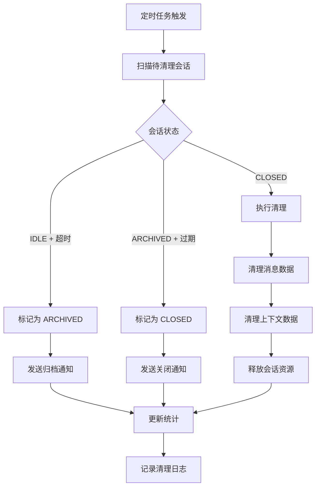
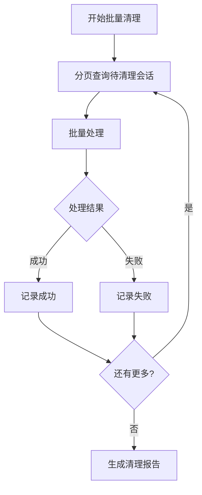

# 会话清理流程

## 流程概述

会话清理流程负责清理过期、空闲或已关闭的会话，释放系统资源。

## 流程图



## 清理策略

### 按状态清理

| 状态 | 清理条件 | 清理动作 |
|------|----------|----------|
| IDLE | 空闲超过 `idle_timeout_ms` | 转为 ARCHIVED |
| ARCHIVED | 归档超过 `archive_retention_days` | 转为 CLOSED |
| CLOSED | 关闭后立即 | 清理所有数据 |

### 定时任务配置

| 任务 | 执行频率 | 说明 |
|------|----------|------|
| 空闲会话扫描 | 每 5 分钟 | 检查 IDLE 状态超时会话 |
| 归档会话清理 | 每小时 | 检查 ARCHIVED 状态过期会话 |
| 资源释放 | 实时 | 清理 CLOSED 状态会话数据 |

## 详细流程步骤

### 步骤 1: 空闲会话检测

**触发条件**: 定时任务每 5 分钟执行

**检测逻辑**:

```python
def find_idle_sessions():
    threshold = datetime.utcnow() - timedelta(milliseconds=idle_timeout_ms)
    return sessions.filter(
        state == SessionState.IDLE,
        updated_at < threshold
    )
```

**参数**:
- `idle_timeout_ms`: 空闲超时时间，默认 3600000ms (1小时)

### 步骤 2: 状态转换为 ARCHIVED

**转换动作**:
- 更新状态为 ARCHIVED
- 设置 `archived_at` 时间戳
- 发送归档事件

**事件数据**:
```json
{
  "event_type": "session_archived",
  "session_id": "sess_xxx",
  "reason": "idle_timeout",
  "archived_at": "2024-01-15T10:30:00Z"
}
```

### 步骤 3: 归档会话检测

**触发条件**: 定时任务每小时执行

**检测逻辑**:

```python
def find_expired_archived_sessions():
    threshold = datetime.utcnow() - timedelta(days=archive_retention_days)
    return sessions.filter(
        state == SessionState.ARCHIVED,
        archived_at < threshold
    )
```

**参数**:
- `archive_retention_days`: 归档保留天数，默认 30 天

### 步骤 4: 状态转换为 CLOSED

**转换动作**:
- 更新状态为 CLOSED
- 记录关闭原因
- 发送关闭事件

### 步骤 5: 清理会话数据

**清理内容**:

| 数据类型 | 清理方式 | 说明 |
|----------|----------|------|
| 消息数据 | 删除或归档 | 可选归档到冷存储 |
| 上下文数据 | 删除 | 释放内存 |
| 会话元数据 | 保留摘要 | 用于统计和审计 |
| 关联资源 | 解绑 | 释放 Agent 绑定等 |

### 步骤 6: 更新统计

**统计更新**:
- 减少活跃会话计数
- 更新清理统计
- 记录资源释放量

### 步骤 7: 记录审计日志

**日志内容**:
```json
{
  "action": "session_cleaned",
  "session_id": "sess_xxx",
  "previous_state": "archived",
  "reason": "retention_expired",
  "messages_deleted": 50,
  "resources_freed": "10MB",
  "timestamp": "2024-01-15T10:30:00Z"
}
```

## 手动清理

### 用户主动关闭

**触发条件**: 用户调用关闭 API

**流程**:
```
用户请求 → 验证权限 → 状态转换为 CLOSED → 清理数据 → 返回确认
```

**API**:
```
DELETE /sessions/{session_id}
```

### 管理员强制清理

**触发条件**: 管理员调用管理 API

**权限**: 需要 `admin` 角色

**API**:
```
POST /admin/sessions/cleanup
{
  "criteria": {
    "states": ["archived"],
    "older_than_days": 7
  }
}
```

## 批量清理

### 批量清理流程



### 批量清理参数

| 参数 | 默认值 | 说明 |
|------|--------|------|
| batch_size | 100 | 每批处理数量 |
| dry_run | false | 是否仅模拟运行 |
| continue_on_error | true | 遇错是否继续 |

## 资源回收

### 内存资源

| 资源 | 回收时机 | 回收方式 |
|------|----------|----------|
| 上下文缓存 | 会话关闭时 | 主动释放 |
| 消息缓存 | 会话关闭时 | 清除引用 |
| 临时数据 | 清理完成时 | GC 回收 |

### 存储资源

| 资源 | 回收时机 | 回收方式 |
|------|----------|----------|
| 消息记录 | 归档/关闭时 | 删除或归档 |
| 会话数据 | 关闭时 | 删除 |
| 审计日志 | 保留 | 不删除 |

## 监控与告警

### 监控指标

| 指标 | 说明 | 告警阈值 |
|------|------|----------|
| cleanup_count | 清理会话数 | - |
| cleanup_errors | 清理错误数 | > 10/hour |
| cleanup_latency | 清理延迟 | > 5s |
| pending_cleanup | 待清理队列长度 | > 1000 |

### 告警规则

```yaml
alerts:
  - name: cleanup_backlog
    condition: pending_cleanup > 1000
    severity: warning
    message: "会话清理队列积压，当前 {{pending_cleanup}} 个待清理"

  - name: cleanup_failures
    condition: cleanup_errors > 10
    severity: error
    message: "会话清理错误率过高，最近1小时 {{cleanup_errors}} 次失败"
```

## 配置

```yaml
session:
  cleanup:
    idle_timeout_ms: 3600000      # 空闲超时: 1小时
    archive_retention_days: 30    # 归档保留: 30天
    batch_size: 100               # 批量处理大小
    scan_interval_ms: 300000      # 扫描间隔: 5分钟
```

## 相关流程

- [会话创建流程](./session-creation.md)
- [Session 状态机](../state-machine.md)
