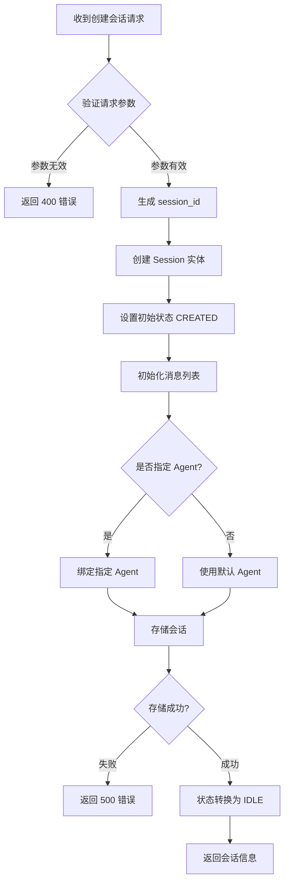

# 会话创建流程

## 流程概述

会话创建流程处理用户与 Agent 建立新会话的请求，创建会话实体并初始化相关资源。

## 流程图



## 流程步骤

### 步骤 1: 接收请求

**触发条件**: 
- HTTP POST `/sessions`
- WebSocket 连接建立

**请求参数**:

| 参数 | 类型 | 必填 | 说明 |
|------|------|------|------|
| model | string | 否 | 使用的模型，默认使用配置的默认模型 |
| agent_id | string | 否 | 指定 Agent ID |
| metadata | dict | 否 | 会话元数据 |

**示例请求**:
```json
{
  "model": "gpt-4",
  "agent_id": "default",
  "metadata": {
    "user_id": "user123",
    "source": "web"
  }
}
```

### 步骤 2: 参数验证

**验证规则**:

| 规则 | 条件 | 错误码 |
|------|------|--------|
| 模型有效性 | model 必须在支持的模型列表中 | INVALID_MODEL |
| Agent 有效性 | agent_id 必须存在 | AGENT_NOT_FOUND |
| 元数据格式 | metadata 必须是有效 JSON | INVALID_METADATA |

**错误响应示例**:
```json
{
  "error": {
    "code": "INVALID_MODEL",
    "message": "Model 'invalid-model' is not supported",
    "details": {
      "supported_models": ["gpt-4", "gpt-4-turbo", "claude-3-opus"]
    }
  }
}
```

### 步骤 3: 生成会话 ID

**生成规则**:
- 使用 UUID v4 格式
- 格式: `sess_{uuid}`

**示例**: `sess_550e8400-e29b-41d4-a716-446655440000`

### 步骤 4: 创建会话实体

**实体属性**:

```python
Session(
    session_id="sess_xxx",
    agent_id="default",
    state=SessionState.CREATED,
    created_at=datetime.utcnow(),
    updated_at=datetime.utcnow(),
    model="gpt-4",
    message_count=0,
    metadata={"user_id": "user123"}
)
```

### 步骤 5: 初始化资源

**初始化内容**:
- 消息列表（空列表）
- 上下文管理器
- 会话配置

### 步骤 6: 绑定 Agent

**分支处理**:
- 指定 Agent: 验证并绑定
- 未指定: 使用默认 Agent 配置

### 步骤 7: 持久化存储

**存储操作**:
- 存储会话实体到会话存储
- 初始化消息存储

### 步骤 8: 状态转换

**转换**: CREATED → IDLE

**触发动作**:
- 设置 updated_at
- 发送会话创建事件

### 步骤 9: 返回响应

**响应内容**:

```json
{
  "id": "sess_550e8400-e29b-41d4-a716-446655440000",
  "agent_id": "default",
  "model": "gpt-4",
  "state": "idle",
  "created_at": 1704067200.123,
  "message_count": 0,
  "metadata": {
    "user_id": "user123"
  }
}
```

## 异常处理

### 参数验证失败

**错误码**: 400 Bad Request

**处理方式**: 直接返回错误信息，不创建会话

### 存储失败

**错误码**: 500 Internal Server Error

**处理方式**: 
- 记录错误日志
- 返回通用错误信息
- 不暴露内部错误细节

### Agent 绑定失败

**错误码**: 404 Not Found

**处理方式**:
- 返回 Agent 不存在错误
- 提供可用 Agent 列表

## 业务规则

### BR-SC-001: 会话 ID 唯一性

**规则**: 每个会话 ID 必须全局唯一

**实现**: 使用 UUID v4 生成，碰撞概率极低

### BR-SC-002: 默认模型选择

**规则**: 未指定模型时使用配置的默认模型

**配置路径**: `model.default_model`

### BR-SC-003: 会话数量限制

**规则**: 单用户活跃会话数量有限制

**参数**: `max_sessions_per_user`，默认 100

## 性能考虑

### 优化点

1. **ID 生成**: UUID 生成是 CPU 密集操作，考虑预生成池
2. **存储延迟**: 使用异步存储，不阻塞响应
3. **缓存**: 热点会话缓存到内存

### 指标

| 指标 | 目标值 |
|------|--------|
| 创建延迟 | < 50ms |
| 并发创建 | > 1000/s |

## 相关流程

- [消息处理流程](./message-processing.md)
- [会话清理流程](./session-cleanup.md)
