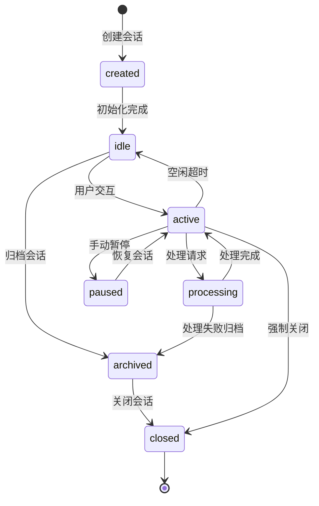
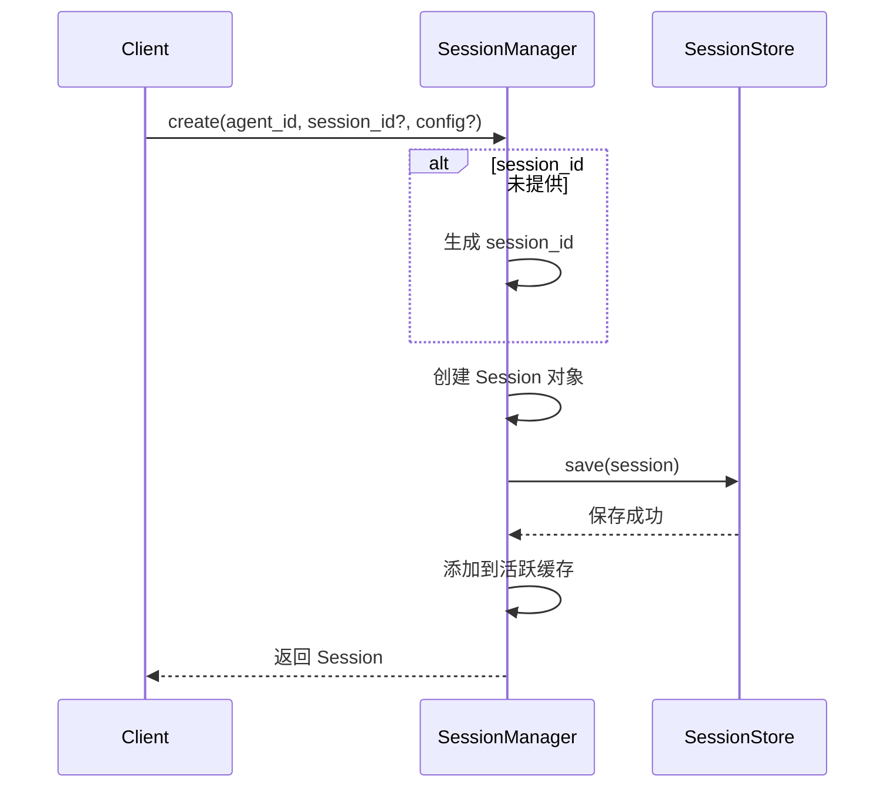
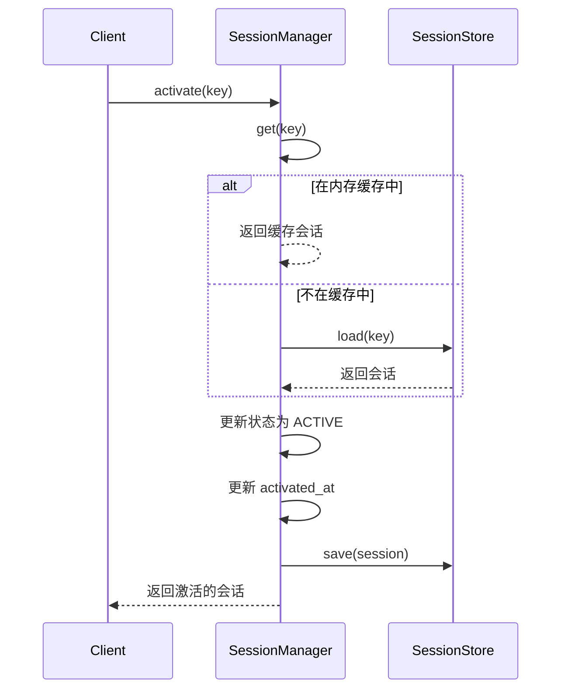
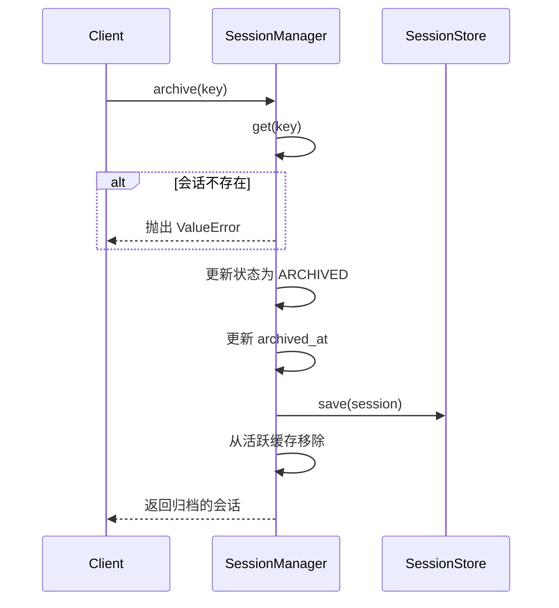

# 会话领域业务文档

## 领域概述

会话领域负责管理用户与 Agent 的交互会话，包括会话的创建、激活、归档等生命周期管理。

## 会话状态机



## 会话状态定义

| 状态 | 枚举值 | 描述 |
|------|--------|------|
| CREATED | `created` | 会话已创建，尚未初始化 |
| IDLE | `idle` | 会话空闲，等待用户输入 |
| ACTIVE | `active` | 会话活跃，正在交互 |
| PROCESSING | `processing` | 正在处理请求 |
| PAUSED | `paused` | 会话暂停 |
| ARCHIVED | `archived` | 会话已归档 |
| CLOSED | `closed` | 会话已关闭 |

## 会话作用域

| 作用域 | 枚举值 | 描述 |
|--------|--------|------|
| MAIN | `main` | 主会话 |
| DIRECT | `direct` | 直接消息 |
| DM | `dm` | 私信 |
| GROUP | `group` | 群组会话 |
| CHANNEL | `channel` | 频道会话 |
| CRON | `cron` | 定时任务会话 |
| RUN | `run` | 运行时会话 |
| SUBAGENT | `subagent` | 子代理会话 |

## 会话键

会话通过 `SessionKey` 唯一标识：

```python
class SessionKey:
    agent_id: str    # 代理ID
    session_id: str  # 会话ID
```

**格式**：`{agent_id}/{session_id}`

**示例**：
- `main/abc123`
- `subagent/xyz789`

## 会话配置

| 配置项 | 类型 | 默认值 | 描述 |
|--------|------|--------|------|
| model | str | `gpt-4` | 使用的模型 |
| system_prompt | str | None | 系统提示 |
| temperature | float | 0.7 | 温度参数 |
| max_tokens | int | None | 最大Token数 |
| context_window | int | 4096 | 上下文窗口大小 |
| enable_tools | bool | True | 是否启用工具 |
| idle_timeout_ms | int | 3600000 | 空闲超时（毫秒） |

## 会话元数据

| 字段 | 类型 | 描述 |
|------|------|------|
| created_at | datetime | 创建时间 |
| updated_at | datetime | 更新时间 |
| activated_at | datetime | 最后激活时间 |
| archived_at | datetime | 归档时间 |
| message_count | int | 消息数量 |
| total_tokens | int | 总Token数 |

## 业务流程

### 创建会话流程

**业务规则**：SESS-001



### 激活会话流程

**业务规则**：SESS-002



### 归档会话流程

**业务规则**：SESS-003



## 业务规则

### SESS-001: 会话ID生成

**规则描述**：会话 ID 不提供时自动生成

**实现**：
```python
def _generate_session_id(self) -> str:
    return str(uuid.uuid4())[:8]
```

**约束**：
- 生成的 ID 为 UUID 前 8 位
- 不保证全局唯一，需配合 agent_id 使用

### SESS-002: 会话空闲超时

**规则描述**：会话空闲超时后自动归档

**配置**：
- `idle_timeout_ms`: 空闲超时时间（默认 1 小时）

**实现**：
- 定时任务检查会话最后活动时间
- 超时后自动调用 `archive()`

### SESS-003: 消息计数

**规则描述**：会话消息数量计入 Token 统计

**实现**：
```python
async def add_message(self, key, message):
    session.messages.append(message)
    session.meta.message_count += 1
    session.meta.updated_at = datetime.now()
    await self.store.save(session)
```

## 会话操作API

| 操作 | 方法 | 描述 |
|------|------|------|
| 创建 | `create()` | 创建新会话 |
| 获取 | `get()` | 获取会话 |
| 激活 | `activate()` | 激活会话 |
| 归档 | `archive()` | 归档会话 |
| 删除 | `delete()` | 删除会话 |
| 列表 | `list()` | 列出会话 |
| 添加消息 | `add_message()` | 添加消息到会话 |

## 相关代码

- [sessions/manager.py](../../../src/tigerclaw/sessions/manager.py)
- [sessions/store.py](../../../src/tigerclaw/sessions/store.py)
- [core/types/sessions.py](../../../src/tigerclaw/core/types/sessions.py)
