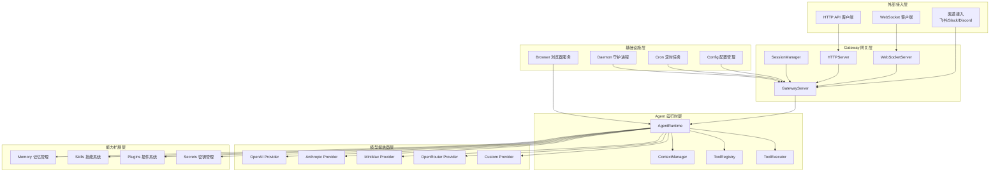

# TigerClaw 服务架构概览

## 项目简介

TigerClaw 是一个 **AI Agent Gateway** 项目，提供统一的 AI Agent 网关服务，支持多种通道和模型提供商。

- **版本**: 0.1.0
- **语言**: Python 3.13+
- **框架**: FastAPI + Uvicorn
- **包管理**: uv

## 架构图



## 核心模块

| 模块 | 路径 | 职责 |
|------|------|------|
| **Gateway** | `src/tigerclaw/gateway/` | 网关服务，HTTP/WebSocket 服务器，会话管理 |
| **Agents** | `src/tigerclaw/agents/` | Agent 运行时，LLM 调用，工具执行 |
| **Providers** | `src/tigerclaw/providers/` | AI 模型提供商适配器 |
| **Memory** | `src/tigerclaw/memory/` | 向量记忆存储与语义检索 |
| **Channels** | `src/tigerclaw/channels/` | 消息渠道接入（飞书等） |
| **Skills** | `src/tigerclaw/skills/` | 技能系统，高级能力封装 |
| **Plugins** | `src/tigerclaw/plugins/` | 插件系统，扩展机制 |
| **Secrets** | `src/tigerclaw/secrets/` | 密钥管理，加密存储 |
| **Cron** | `src/tigerclaw/cron/` | 定时任务调度 |
| **Daemon** | `src/tigerclaw/daemon/` | 守护进程服务管理 |
| **Browser** | `src/tigerclaw/browser/` | 浏览器自动化服务 |
| **Config** | `src/tigerclaw/config/` | 配置管理 |
| **CLI** | `src/tigerclaw/cli/` | 命令行接口 |

## 技术栈

### 核心依赖

| 依赖 | 版本 | 用途 |
|------|------|------|
| fastapi | >=0.115.0 | Web 框架 |
| uvicorn | >=0.32.0 | ASGI 服务器 |
| websockets | >=14.0 | WebSocket 支持 |
| httpx | >=0.28.0 | HTTP 客户端 |
| pydantic | >=2.10.0 | 数据验证 |
| pydantic-settings | >=2.6.0 | 配置管理 |
| typer | >=0.15.0 | CLI 框架 |
| playwright | >=1.40.0 | 浏览器自动化 |
| cryptography | >=42.0.0 | 加密支持 |
| apscheduler | >=3.11.0 | 任务调度 |

### 开发依赖

| 依赖 | 版本 | 用途 |
|------|------|------|
| pytest | >=8.3.0 | 测试框架 |
| ruff | >=0.9.0 | 代码检查 |
| mypy | >=1.14.0 | 类型检查 |

## 快速开始

### 安装

```bash
# 使用 uv 安装依赖
uv pip install -e .

# 安装开发依赖
uv pip install -e ".[dev]"
```

### 启动服务

```bash
# 启动 Gateway 服务
tigerclaw gateway start

# 指定主机和端口
tigerclaw gateway start --host 0.0.0.0 --port 8080

# 指定配置文件
tigerclaw gateway start --config tigerclaw.toml
```

### CLI 命令

```bash
# 与 Agent 对话
tigerclaw agent chat "你好"

# 列出可用工具
tigerclaw agent tools

# 查看配置
tigerclaw config list

# 系统诊断
tigerclaw doctor run
```

## 配置说明

配置文件支持 `tigerclaw.toml`、`config.yaml`、`config.yml` 格式，按以下顺序查找：

1. 当前目录的 `tigerclaw.toml`
2. 当前目录的 `config.yaml`
3. 当前目录的 `config.yml`
4. 用户目录的 `~/.tigerclaw/config.yaml`

### 配置示例

```yaml
gateway:
  host: "127.0.0.1"
  port: 18789
  bind: "loopback"  # auto, lan, loopback, custom, tailnet

model:
  default_model: "anthropic/claude-sonnet-4-6"
  providers:
    openai:
      base_url: "https://api.openai.com/v1"
      api_key: "${OPENAI_API_KEY}"
      models:
        - "gpt-4"
        - "gpt-4-turbo"

channel:
  enabled_channels:
    - "feishu"
    - "slack"
```

## 服务清单

详细的服务文档请参阅 [service-list.md](./service-list.md)。

各服务详细文档：

- [Gateway 网关服务](./services/gateway.md)
- [Agents 运行时](./services/agents.md)
- [Providers 模型提供商](./services/providers.md)
- [Memory 记忆管理](./services/memory.md)
- [Channels 通道管理](./services/channels.md)
- [Skills 技能系统](./services/skills.md)
- [Plugins 插件系统](./services/plugins.md)
- [Secrets 密钥管理](./services/secrets.md)
- [Cron 定时任务](./services/cron.md)
- [Daemon 守护进程](./services/daemon.md)
- [Browser 浏览器服务](./services/browser.md)
