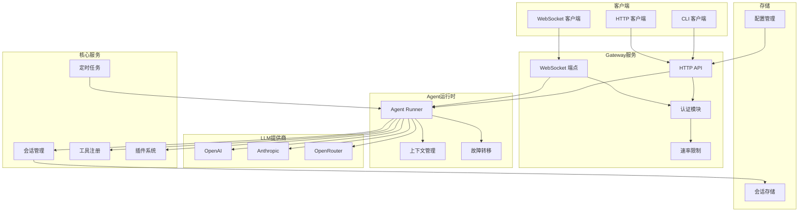

# TigerClaw 服务架构概览

## 项目简介

TigerClaw 是 OpenClaw 的 Python 实现，是一个 AI Agent 网关服务，提供统一的 LLM 调用接口、会话管理、工具执行等能力。

## 技术栈

| 组件 | 技术选型 |
|------|----------|
| 语言 | Python 3.14 |
| Web框架 | FastAPI |
| 异步运行时 | asyncio |
| CLI框架 | Typer |
| 配置管理 | Pydantic Settings |
| 日志 | Loguru |
| 数据库 | SQLite (aiosqlite) |
| HTTP客户端 | httpx |

## 系统架构图



## 模块职责

### 1. Gateway 模块
负责对外提供 API 服务，包括 HTTP REST API 和 WebSocket 实时通信。

- **HTTP API**: 提供 OpenAI 兼容的聊天补全接口
- **WebSocket**: 支持实时双向通信，流式响应
- **认证**: 支持 Token、密码、Tailscale、可信代理等多种认证方式
- **速率限制**: 防止暴力破解和滥用

### 2. Agent 模块
核心运行时，负责 LLM 调用协调和工具执行。

- **Runner**: Agent 主运行循环
- **Providers**: 多 LLM 提供商适配（OpenAI、Anthropic、OpenRouter）
- **Tools**: 工具注册和执行
- **Failover**: 故障转移和重试策略

### 3. Core 模块
基础核心功能，包括配置、日志、类型定义。

- **Config**: YAML 配置加载，环境变量覆盖
- **Logging**: 结构化日志
- **Types**: 核心数据类型定义

### 4. Sessions 模块
会话生命周期管理。

- **Manager**: 会话创建、激活、归档
- **Store**: 会话持久化存储

### 5. Plugins 模块
插件系统，支持动态扩展。

- **Discovery**: 插件发现
- **Loader**: 插件加载
- **Registry**: 插件注册表

### 6. Services 模块
后台服务。

- **Cron**: 定时任务调度
- **Memory**: 向量存储和嵌入
- **Performance**: 缓存、连接池优化

## 服务清单

| 服务名称 | 路径 | 描述 |
|----------|------|------|
| Gateway | `src/tigerclaw/gateway/` | API 网关服务 |
| Agent Runtime | `src/tigerclaw/agents/` | Agent 运行时 |
| Session Manager | `src/tigerclaw/sessions/` | 会话管理服务 |
| Plugin System | `src/tigerclaw/plugins/` | 插件系统 |
| Cron Scheduler | `src/tigerclaw/services/cron/` | 定时任务调度 |

详细文档请查看 [services/](services/) 目录。

## 快速开始

### 启动 Gateway 服务

```bash
# 使用 CLI
tigerclaw gateway start

# 或直接运行
python -m tigerclaw.gateway.server
```

### 使用 Agent 运行时

```python
from tigerclaw.agents.runner import AgentRunner
from tigerclaw.agents.providers.openai import OpenAIProvider

provider = OpenAIProvider(config)
runner = AgentRunner(provider, config)

response = await runner.chat("你好！")
```

## 配置说明

配置文件默认路径：`tigerclaw.yaml`

主要配置项：

```yaml
gateway:
  host: "0.0.0.0"
  port: 8000
  auth:
    mode: "token"  # none, token, password, tailscale, trustedProxy

logging:
  level: "INFO"
  file_enabled: true

agents:
  default_provider: "openai"
  default_model: "gpt-4"
```

## 相关文档

- [服务清单](service-list.md)
- [API 文档](../../docs/api.md)
- [开发指南](../../docs/guide.md)
