# Architecture Diagrams

## System Architecture

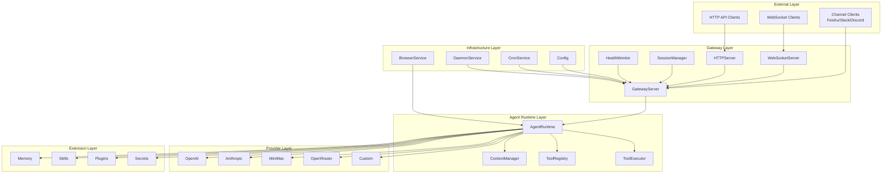

## Request Flow

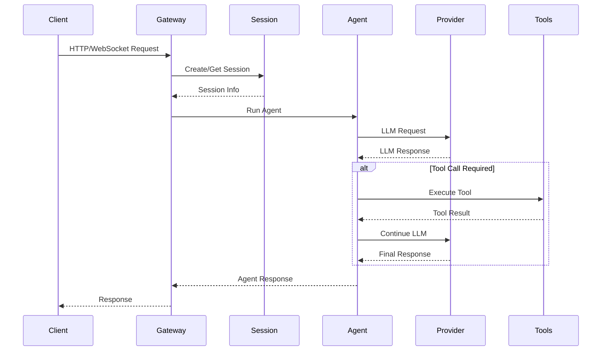

## Provider Selection Flow

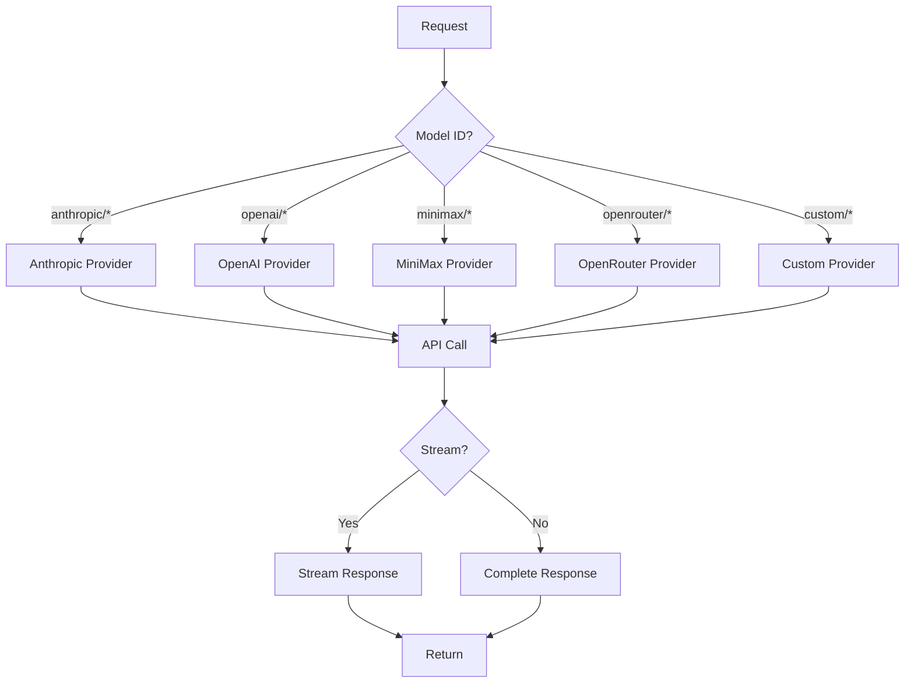

## Session Lifecycle

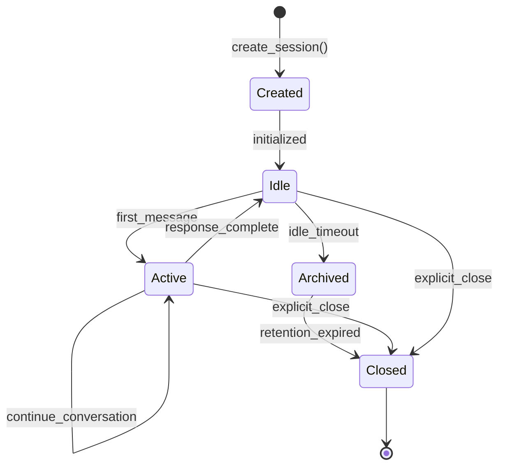

## Plugin Lifecycle

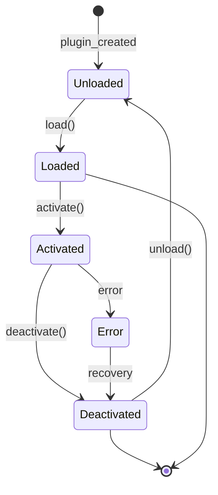

## Memory System

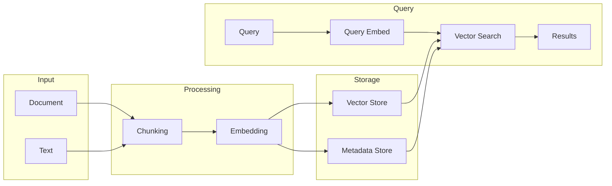

## Channel Integration

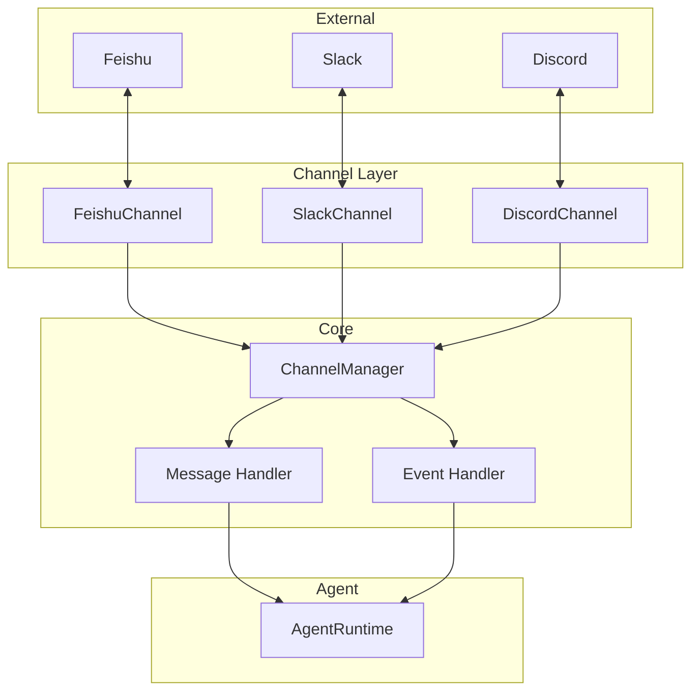

## Cron Job Execution

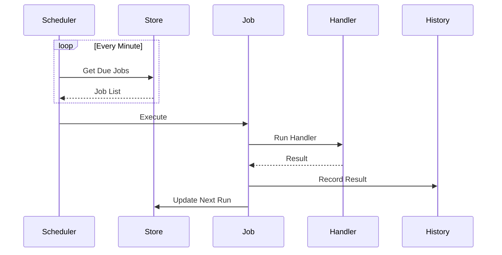

## Daemon Service Management

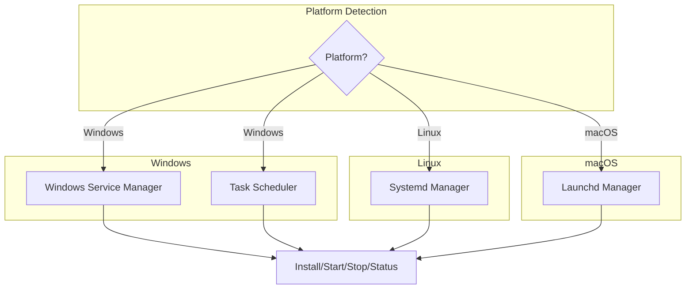

## Browser Automation Flow

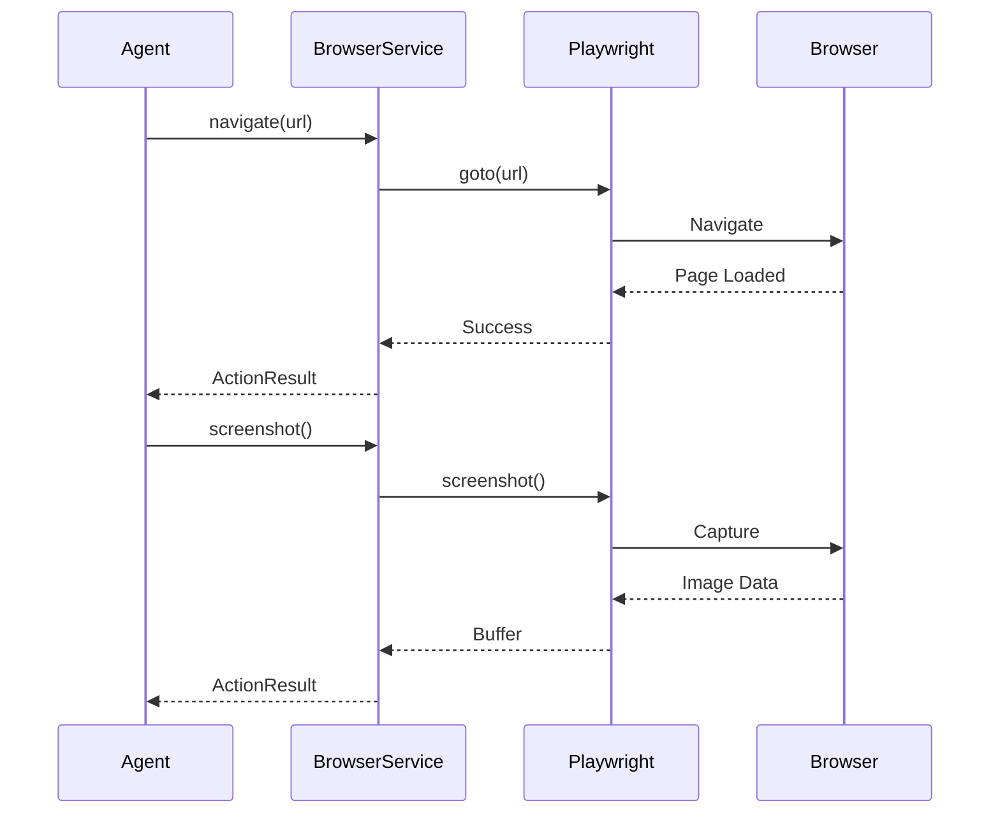

## Secrets Management

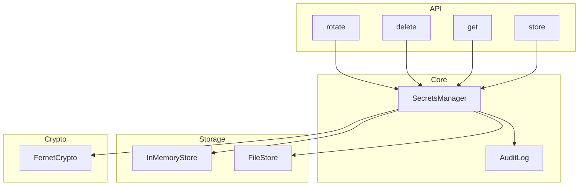
