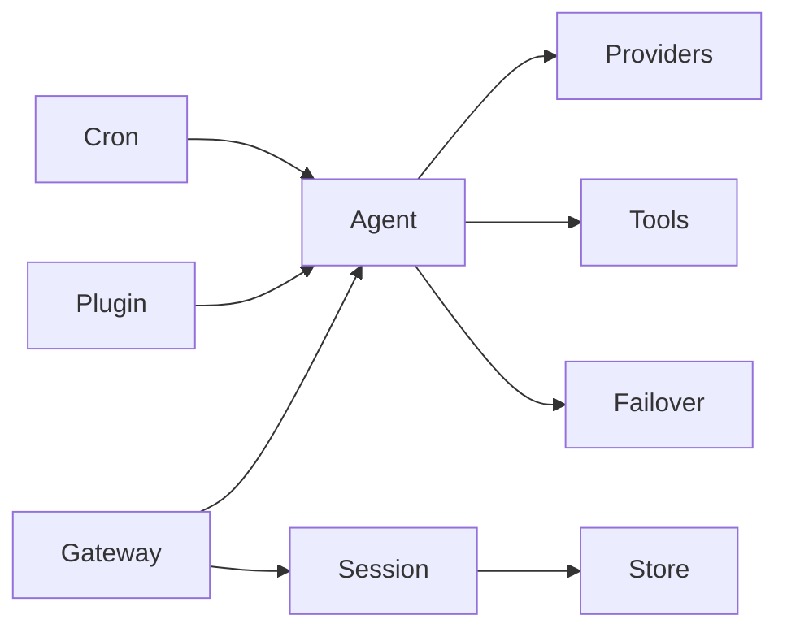

# TigerClaw 服务清单

## 服务概览

TigerClaw 采用模块化架构，各服务职责明确，通过清晰的接口进行交互。

| 服务名称 | 语言/框架 | 入口文件 | 核心功能 |
|----------|-----------|----------|----------|
| Gateway | Python/FastAPI | `gateway/server.py` | HTTP/WebSocket API 网关 |
| Agent Runtime | Python/asyncio | `agents/runner.py` | LLM 调用协调 |
| Session Manager | Python/asyncio | `sessions/manager.py` | 会话生命周期管理 |
| Plugin System | Python | `plugins/loader.py` | 插件加载与管理 |
| Cron Scheduler | Python/asyncio | `services/cron/scheduler.py` | 定时任务调度 |

---

## Gateway 服务

### 基本信息

| 属性 | 值 |
|------|-----|
| 服务名称 | Gateway |
| 路径 | `src/tigerclaw/gateway/` |
| 框架 | FastAPI |
| 端口 | 8000 (默认) |
| 协议 | HTTP, WebSocket |

### 核心组件

| 组件 | 文件 | 描述 |
|------|------|------|
| Server | `server.py` | FastAPI 应用入口 |
| HTTP Router | `http.py` | REST API 路由 |
| WebSocket | `websocket.py` | WebSocket 端点 |
| Auth | `auth.py` | 认证处理 |
| Rate Limit | `rate_limit.py` | 速率限制 |

### API 端点

| 端点 | 方法 | 描述 |
|------|------|------|
| `/` | GET | 服务信息 |
| `/health` | GET | 健康检查 |
| `/api/v1/chat/completions` | POST | 聊天补全 |
| `/api/v1/sessions` | GET/POST | 会话管理 |
| `/api/v1/models` | GET | 模型列表 |
| `/api/v1/tools` | GET | 工具列表 |
| `/ws` | WebSocket | 实时通信 |

### 认证方式

| 模式 | 描述 |
|------|------|
| `none` | 无认证 |
| `token` | Bearer Token |
| `password` | 密码认证 |
| `tailscale` | Tailscale 网络认证 |
| `trustedProxy` | 可信代理认证 |

---

## Agent Runtime 服务

### 基本信息

| 属性 | 值 |
|------|-----|
| 服务名称 | Agent Runtime |
| 路径 | `src/tigerclaw/agents/` |
| 类型 | 运行时库 |

### 核心组件

| 组件 | 文件 | 描述 |
|------|------|------|
| Runner | `runner.py` | Agent 主运行循环 |
| Context | `context.py` | 对话上下文管理 |
| Failover | `failover.py` | 故障转移策略 |
| Tool Registry | `tool_registry.py` | 工具注册与执行 |

### LLM 提供商

| 提供商 | 文件 | 支持模型 |
|--------|------|----------|
| OpenAI | `providers/openai.py` | gpt-4, gpt-3.5-turbo, o1, o3 |
| Anthropic | `providers/anthropic.py` | claude-3-5-sonnet, claude-3-opus |
| OpenRouter | `providers/openrouter.py` | openrouter/auto, 多模型 |

### 故障转移策略

| 错误类型 | 策略 |
|----------|------|
| RATE_LIMIT | 认证轮换 |
| AUTH_ERROR | 认证轮换 |
| MODEL_NOT_FOUND | 模型降级 |
| TIMEOUT | 重试 |
| NETWORK_ERROR | 重试 |
| SERVER_ERROR | 重试 |
| CONTEXT_TOO_LONG | 终止 |

---

## Session Manager 服务

### 基本信息

| 属性 | 值 |
|------|-----|
| 服务名称 | Session Manager |
| 路径 | `src/tigerclaw/sessions/` |
| 存储后端 | SQLite (aiosqlite) |

### 核心组件

| 组件 | 文件 | 描述 |
|------|------|------|
| Manager | `manager.py` | 会话管理器 |
| Store | `store.py` | 持久化存储 |

### 会话状态

| 状态 | 描述 |
|------|------|
| CREATED | 已创建 |
| ACTIVE | 活跃中 |
| ARCHIVED | 已归档 |

### 会话操作

| 操作 | 方法 | 描述 |
|------|------|------|
| 创建 | `create()` | 创建新会话 |
| 获取 | `get()` | 获取会话 |
| 激活 | `activate()` | 激活会话 |
| 归档 | `archive()` | 归档会话 |
| 删除 | `delete()` | 删除会话 |
| 列表 | `list()` | 列出会话 |

---

## Plugin System 服务

### 基本信息

| 属性 | 值 |
|------|-----|
| 服务名称 | Plugin System |
| 路径 | `src/tigerclaw/plugins/` |
| 类型 | 插件框架 |

### 核心组件

| 组件 | 文件 | 描述 |
|------|------|------|
| Discovery | `discovery.py` | 插件发现 |
| Loader | `loader.py` | 插件加载 |
| Registry | `registry.py` | 插件注册表 |
| Lifecycle | `lifecycle.py` | 生命周期管理 |
| Sandbox | `sandbox.py` | 沙箱执行 |

### 插件生命周期

```
发现 → 加载 → 初始化 → 运行 → 卸载
```

### 内置插件

| 插件 | 路径 | 描述 |
|------|------|------|
| Feishu | `extensions/feishu/` | 飞书集成 |

---

## Cron Scheduler 服务

### 基本信息

| 属性 | 值 |
|------|-----|
| 服务名称 | Cron Scheduler |
| 路径 | `src/tigerclaw/services/cron/` |
| 类型 | 后台服务 |

### 核心组件

| 组件 | 文件 | 描述 |
|------|------|------|
| Scheduler | `scheduler.py` | 任务调度器 |
| Parser | `cron_parser.py` | Cron 表达式解析 |
| Monitor | `monitor.py` | 任务监控 |
| Task Store | `task_store.py` | 任务存储 |

### 任务类型

| 类型 | 描述 |
|------|------|
| ONCE | 一次性任务 |
| INTERVAL | 间隔任务 |
| CRON | Cron 表达式任务 |

### 任务状态

| 状态 | 描述 |
|------|------|
| PENDING | 待执行 |
| RUNNING | 执行中 |
| COMPLETED | 已完成 |
| FAILED | 失败 |
| CANCELLED | 已取消 |

---

## 服务依赖关系



## 详细文档

- [Gateway 服务详情](services/gateway.md)
- [Agent Runtime 详情](services/agent-runtime.md)
- [Session Manager 详情](services/session-manager.md)
- [Plugin System 详情](services/plugin-system.md)
- [Cron Scheduler 详情](services/cron-scheduler.md)
